# 开源项目研究索引

这里记录对开源项目的源码研究、原版复现与独立演示。每个子项目都注明研究版本、图片来源、实际验证结果和仍存在的限制。

## 值得继续沉淀的产品方向

这轮研究中，以下三个方向值得自己持续投入，把资料、想法和技术理解逐步沉淀为可长期使用的产品。

- **个人资源导航入口**：将 [007 · OSINT 资源地图](projects/007-osint-resource-map/README.md) 中的 `awesome-osint` 与 `awesome-osint-arsenal` 两个资源库继续整理，开发类似 hao123 的个人研究与开发入口。按主题和任务组织资源，逐步加入搜索、收藏、中文使用说明、链接核验与个人使用记录，让收集到的资源成为日常可用的工具入口。
- **AI 创业思路产品**：继续扩展 [008 · AI 创业思路与案例](projects/008-ai-money-maker-handbook/README.md)，把案例、自己的想法、需求观察、产品小样和实践反馈持续沉淀，形成个人 AI 创业思路工作台，支持从发现方向到验证产品方案的过程。
- **可插拔框架与产品化生图**：以 [010 · AntV Infographic](projects/010-antv-infographic/README.md) 为研究起点，理解按类型选模板、组件注册与组合、布局和插件生命周期。当前按需把结构化内容转换为图表或信息图；后期亲手研究并实现可插拔框架，探索模板化报告、批量配图和可扩展编辑器等产品方案。

目前已有资源整理与研究演示，后续继续围绕自己的真实使用需求开发、验证和迭代；上述完整产品能力仍待逐步实现。

## 子项目索引

编号按加入顺序分配，从 `001` 开始。编号一经使用便保持不变，后续研究更新原条目即可。

| 编号 | 当前研究 | 摘要描述 | 源库 | 关联网页 | 进度 |
| :---: | --- | --- | --- | --- | --- |
| 001 | [Storm-Breaker 能力与原理研究](projects/001-storm-breaker/README.md) | 主题网页读取部分环境信息，在授权后请求位置与音视频；PHP 回传并由面板展示。扩展场景需另行开发。 | [ultrasecurity/Storm-Breaker](https://github.com/ultrasecurity/Storm-Breaker) | [在线研究网页](https://yydshly.github.io/0928_codex_project/001-storm-breaker/) | 已发布；原版已复现；音频落盘未证实 |
| 002 | [AIRI 能力与角色交互研究](projects/002-airi/README.md) | 面向虚拟陪伴的 Agent 应用工程；按需组合对话、语音、角色、视觉及执行工具。沉淀接入、表现和执行反馈思路，后期按需参考。 | [moeru-ai/airi](https://github.com/moeru-ai/airi) | [在线研究网页](https://yydshly.github.io/0928_codex_project/002-airi/) | 已发布；归档参考；暂不深入；原版未运行 |
| 003 | [Grok Bot Field Notes 工程经验与使用参考](projects/003-grokbot-field-notes/README.md) | Agent 工程案例与模板资料库：以规则、职责与验证反馈组织工作，可转化为验证工具、任务约定和技能；适用开发、研究与业务流程。有经验者新增价值有限，归档后按需参考。 | [unicodef1wn/grokbot-field-notes](https://github.com/unicodef1wn/grokbot-field-notes) | [在线研究网页](https://yydshly.github.io/0928_codex_project/003-grokbot-field-notes/) | 已发布；归档参考；新增方法有限；原平台未运行 |
| 004 | [ACE-Step UI 音乐创作能力研究](projects/004-ace-step-ui/README.md) | ACE-Step 1.5 音乐工作台：描述/歌词、Reference、Cover、Repaint 与候选管理；6 个 DiT 和 3 个可选 LM 选项，输出歌曲/纯音乐音频。参考价值是模型能力的产品化与创作迭代。 | [fspecii/ace-step-ui](https://github.com/fspecii/ace-step-ui) | [在线研究网页](https://yydshly.github.io/0928_codex_project/004-ace-step-ui/) | 已发布；原版未运行；效果未实测 |
| 005 | [Tailcat 加密 P2P 连接能力研究](projects/005-tailcat/README.md) | 无需 Tailscale 控制平面的双端连接工具：DERP 会合与回退、UDP 打洞优先直连、WireGuard 始终加密；用于端口、SSH、文件等传输。 | [tailscale/tailcat](https://github.com/tailscale/tailcat) | [在线研究网页](https://yydshly.github.io/0928_codex_project/005-tailcat/) | 已发布；原版和性能未实测 |
| 006 | [Personal Edge Proxy 个人代理架构研究](projects/006-personal-edge-proxy/README.md) | 个人代理的组件组合与配置参考：客户端经 HY2 或 VLESS/REALITY/Vision 接入 VPS，再按目标选 Direct、WARP 或固定 SOCKS5。用于个人出网、开发访问和出口管理，沉淀协议分层与排障方法。 | [yding-git/personal-edge-proxy](https://github.com/yding-git/personal-edge-proxy) | [在线研究网页](https://yydshly.github.io/0928_codex_project/006-personal-edge-proxy/) | 已发布并验证；原方案未实测 |
| 007 | [OSINT 资源地图：个人研究入口](projects/007-osint-resource-map/README.md) | 两库提供公开来源与安全研究的候选资源；全景图和网页按 12 个任务主题引导选择。值得持续整理为个人入口，逐步加入操作卡、资源核验与结果记录。 | [jivoi/awesome-osint](https://github.com/jivoi/awesome-osint) · [rawfilejson/awesome-osint-arsenal](https://github.com/rawfilejson/awesome-osint-arsenal) | [在线研究网页](https://yydshly.github.io/0928_codex_project/007-osint-resource-map/) | 已发布并验证；外部工具与安装脚本未实测 |
| 008 | [AI Money Maker Handbook：AI 创业思路与案例](projects/008-ai-money-maker-handbook/README.md) | 面向 AI 创业的思路整理与案例收集库，涵盖 AI 图文、音频、直播、绘本、视频、工具和知识服务等创业方向，帮助探索需求、产品与商业模式；可持续整理为个人 AI 创业探索入口。 | [XiaomingX/ai-money-maker-handbook](https://github.com/XiaomingX/ai-money-maker-handbook) | [在线研究网页](https://yydshly.github.io/0928_codex_project/008-ai-money-maker-handbook/#map) | 已发布并验证；产品化持续迭代，经营方向待实践 |
| 009 | [Jev Ultrafast 快速网页智能体研究](projects/009-jev-ultrafast/README.md) | 网页操作智能体：库读取 DOM 并编号，Jev 选择操作与目标，程序复核执行，输入时另请文本模型写字段值。适合搜索、筛选和表单流程；价值在于缩短决策与页面读取路径，为自己的网页自动化工具积累实现方法。 | [browser-use/jev-ultrafast](https://github.com/browser-use/jev-ultrafast) | [在线研究网页](https://yydshly.github.io/0928_codex_project/009-jev-ultrafast/) | 已发布并验证；上游未本机运行；性能未独立复测 |
| 010 | [AntV Infographic 能力与可扩展架构研究](projects/010-antv-infographic/README.md) | 把结构化内容转换为图表或信息图：按表达类型选择模板，填入数据后由组件与布局程序绘制。用于研究配图、流程说明、方案对比和报告，减少重复排版；作为个人按需绘图工具，后期研究其架构，用于可插拔产品设计及相关产品方案。 | [antvis/Infographic](https://github.com/antvis/Infographic) | [在线研究网页](https://yydshly.github.io/0928_codex_project/010-antv-infographic/) | 已发布；线上七类渲染已核验；本机交互与导出已验证；架构实验与产品方案待探索 |
| 011 | [vphone-aio：Mac 虚拟 iPhone 启动整合包](projects/011-vphone-aio/README.md) | 面向 Apple 芯片 Mac 的虚拟 iPhone 整合包；脚本下载缺失分片、解压预制环境、启动上游 vphone-cli，并提供 VNC/SSH 连接。作为脚本化交付案例简要收录。 | [34306/vphone-aio](https://github.com/34306/vphone-aio) | 暂无 | 已完成简要整理；原版未运行；暂不深入 |

### 001 · Storm-Breaker

[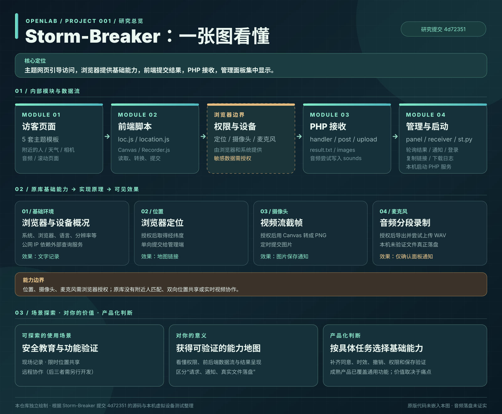](projects/001-storm-breaker/assets/storm-breaker-understanding.svg)

图：本仓库根据[所研究的原仓库提交](https://github.com/ultrasecurity/Storm-Breaker/tree/4d7235104870ec0224f445fd905c98f22a105426)与本机虚拟设备测试独立绘制；不是原项目截图。点击图片可放大查看。

#### 基础能力与原理

Storm-Breaker 以五套主题网页引导访问，读取部分浏览器环境信息；在浏览器授权后请求精确位置、摄像头或麦克风。前端将结果提交给 PHP 接收脚本，再由管理面板呈现。它没有附近的人匹配、访客间位置共享或实时协作功能。

#### 场景探索与研究价值

授权环境中的安全教育可以直接演示权限边界。现场记录、限时位置共享和远程协作只是基于位置与音视频的扩展方向，需按具体需求设计同意、时效、撤销、访问控制和可靠保存。研究这个库的价值是看懂浏览器权限与前后端数据流，并用源码和实测判断产品设想是否有依据。

本机原版复现已验证文本、模拟位置和虚拟摄像头图片的回传；音频仅出现面板通知，文件落盘未证实。原版代码与名称归原作者及贡献者所有，所研究版本未见明确 LICENSE；图片来源及使用限制见[子项目说明](projects/001-storm-breaker/README.md#图片参考与许可)。

[原仓库](https://github.com/ultrasecurity/Storm-Breaker) · [详细研究](projects/001-storm-breaker/research.md) · [原版运行说明](projects/001-storm-breaker/README.md#原版效果) · [在线研究网页](https://yydshly.github.io/0928_codex_project/001-storm-breaker/)

### 002 · AIRI

[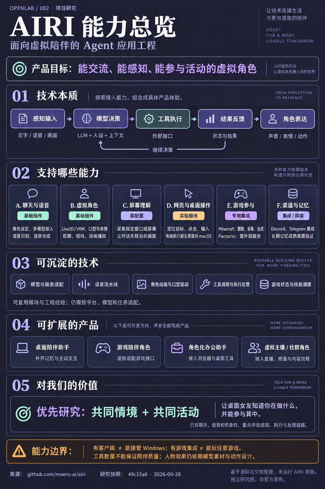](projects/002-airi/assets/airi-capability-overview.png)

图：本仓库依据 [AIRI 固定研究提交](https://github.com/moeru-ai/airi/tree/49c15a6df2a1595dfd0ef2771abfc1229504d075) 整理，使用内置 imagegen 生成并核对，非官方宣传或原版运行截图。扩展产品是后续开发方向。

**库的能力**：把角色对话、语音、Live2D / VRM 表现、屏幕理解与外部工具组织在一起；提供 Minecraft、Factorio、Discord、Telegram 等专用集成。功能分布在主应用、独立服务和实验模块中，需分别配置。

**技术本质**：面向虚拟陪伴的 Agent 应用工程。模型结合人设与上下文作出决策，按需接入感知和执行能力，再以声音、表情和动作呈现结果。陪伴是产品目标，操作是可扩展能力。

**可沉淀技术**：模型与服务适配、语音输入输出流水线、角色动画与口型协调、工具调用与执行反馈、游戏状态读取与技能调度，以及多端共享模块的组织方式。实际复用仍需适配。

**使用场景**：配置后的角色聊天与语音交流、桌面虚拟角色展示；接入视觉后的屏幕相关对话；运行专用服务后的游戏互动与社群聊天；多模态 Agent 原型验证。

**可扩展方向**：桌面陪伴助手、游戏陪伴角色、角色化办公助手、虚拟主播与社群角色。需要按目标补齐长期记忆、主动交互、平台执行器、游戏接口或直播流程，并非全部现成产品。

**对我的意义**：现阶段具有参考价值，保留为后期技术选型与实现参考，暂不继续深入研究或复现。待桌面女友出现明确的视觉、工具执行、游戏或角色表现需求时，再按模块查阅与验证。

当前电脑操作服务主要面向 macOS，不能从 Windows 客户端支持推定 Windows 执行器已就绪；游戏需逐款接入，长期记忆与陪伴质量未实测。原项目代码采用 MIT 许可，角色模型、声音与其他素材需单独核查。

[原仓库](https://github.com/moeru-ai/airi) · [详细研究](projects/002-airi/research.md) · [在线研究网页](https://yydshly.github.io/0928_codex_project/002-airi/) · [运行与发布说明](projects/002-airi/web/README.md)

### 003 · Grok Bot Field Notes

[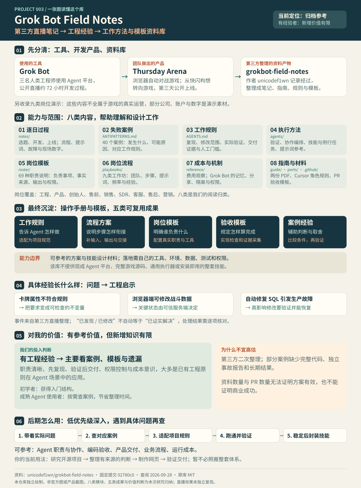](projects/003-grokbot-field-notes/web/assets/understanding-guide.svg)

图：本仓库依据[固定研究提交](https://github.com/unicodef1wn/grokbot-field-notes/tree/02780c04ef5f412b28573bce6f82afd15d195d1f)及本次讨论独立绘制；覆盖范围、成果与价值判断，非官方图片或产品截图。

**库的能力**：提供三天产品开发笔记、失败案例、Agent 工作规则、验证与编排指南、岗位模板、业务流程和成本观察，帮助理解开发过程、设计协作与验收。它交付的是第三方资料与配置素材，不能直接运行 Grok Bot 或复现游戏。

**技术本质**：把工程经验写成 Agent 与人共享的目标、职责、事实来源、工具使用和完成标准；由现有 Agent 平台执行，由项目自己的检查器验证，再将反馈更新到规则。核心是工作约定与反馈机制，未提供新模型、推理算法或运行平台。

**可沉淀技术**：可转化为项目规则与任务输入输出约定、验证命令与证据采集、角色交接与异常升级、PR 验收记录、例行任务成本审查，以及经验证的技能封装。原库主要提供原则和样例；具体工具、程序、权限及测试需要自行适配实现。

**使用场景**：适用于 Agent 辅助编码与缺陷修复、开源项目研究和网页交付、产品原型与上线验收、小规模多 Agent 协作，以及客服、销售、营销等重复工作流程的设计。业务演示需重新接入真实资料和工具，不能直接视为已验证经营效果。

**可扩展方向**：可进一步做成项目验证工具包、开源研究助手技能、带状态记录与人工门槛的协作流程，或工程事故与评估知识库。需要分别补齐检查器、数据接入、执行与重试机制、权限控制及持续评估；这些是我们的迁移方向，尚未实现。

**对我的意义**：对已有工程经验的你，新增方法有限；价值主要在具体案例、模板整理和遗漏检查。当前适合归档参考，降低持续深入优先级。以后遇到研究、Agent 协作或交付验证的问题，再按需查阅、适配并验证，无需整体照搬。

**案例与验证边界**：Grok Bot 是团队使用的工具，Thursday Arena 是直播中做出的自动对战游戏，本库是第三方对开发直播与岗位演示的整理。原库采用 MIT 许可；引导图为本仓库自绘。未运行原平台，直播数字未独立复算，尚未安装技能或实现扩展方向。

[原仓库](https://github.com/unicodef1wn/grokbot-field-notes) · [详细研究](projects/003-grokbot-field-notes/research.md) · [在线研究网页](https://yydshly.github.io/0928_codex_project/003-grokbot-field-notes/) · [运行与部署约定](projects/003-grokbot-field-notes/web/README.md)

### 004 · ACE-Step UI

[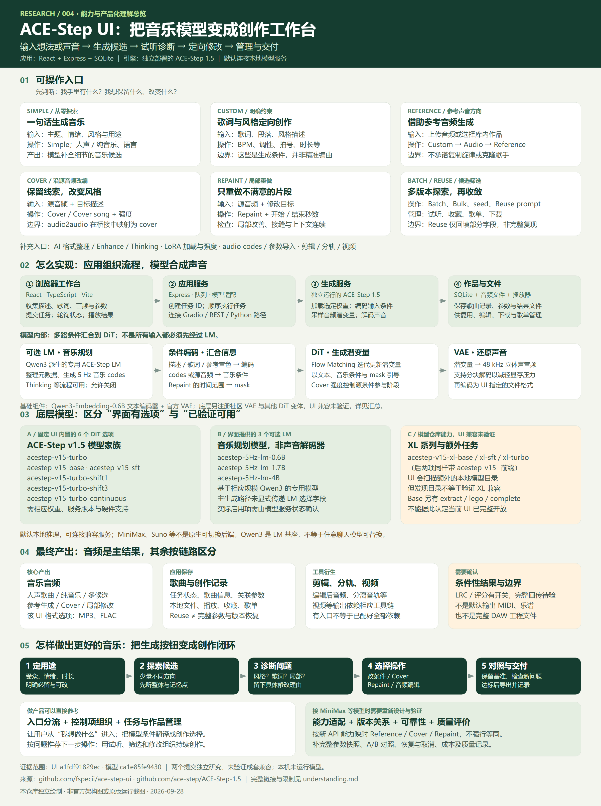](projects/004-ace-step-ui/assets/understanding-overview.svg)

图为本仓库依据 [ACE-Step UI 固定研究提交](https://github.com/fspecii/ace-step-ui/tree/a1fdf91829ec6f7b98844f80e323529cd155dbf2) 与 [ACE-Step 1.5 模型文档](https://github.com/ace-step/ACE-Step-1.5/tree/ca1e85fe9430179831e6bc6be790c332190a3866) 独立绘制，不是原项目截图或模型生成结果。

**库的能力**：把文字或歌词生成音乐、风格和音乐参数控制、参考音频、Cover、Repaint、作品播放与歌单，以及音频剪辑等辅助工具组织进同一创作工作台。

**完整理解**：[一张图总览](projects/004-ace-step-ui/web/overview.html)与[汇总说明](projects/004-ace-step-ui/understanding.md)串起六类入口、应用和模型原理、底层模型及产出。UI 内置六个 DiT 选项与三个可选 LM；XL 的 UI 兼容、LM 选择实际生效以及 LRC / 评分完整输出仍需验证。主结果是 MP3 / FLAC 音频和作品记录。

**底层本质**：基于 ACE-Step 1.5 的音乐创作应用，默认连接本地模型服务。做产品可先把模型看成输入输出黑盒；内部 DiT 是生成模型，潜变量是它处理的数字表示，VAE 负责声音与表示之间的转换。React / Express / SQLite 组织任务、文件与作品管理。

**支持模型**：UI 固定列出 ACE-Step v1.5 的 base、sft、turbo、turbo-shift1、turbo-shift3、turbo-continuous；可选专用音乐 LM 为 0.6B / 1.7B / 4B，基于对应规模 Qwen3，配套 Qwen3-Embedding-0.6B 与 VAE。XL 及额外变体的 UI 兼容性未验证；MiniMax 等需另做适配。

**输出效果**：带人声歌曲、纯音乐、多候选、改编或局部重绘结果，UI 主要导出 MP3 / FLAC，并保存歌曲记录。剪辑、分轨、视频依赖辅助工具；LRC / 评分完整输出未验证。公开样例是模型团队成果，不是本机生成。

**入口与场景**：Simple 描述、Custom 歌词/风格、Reference 参考音频、Cover 源音频改编、Repaint 起止区间、Batch / Reuse 候选与复用；适合歌曲草稿、配乐探索与反复试听修改，组成“定目标 → 探方向 → 找问题 → 针对性修改 → 对照交付”的创作流程。见[创作控制指南](projects/004-ace-step-ui/web/creation.html)与[产品分析](projects/004-ace-step-ui/creation-guide.md)。

**对我们的价值**：重点借鉴入口分流、条件控制、任务与作品管理，以及“探索 → 试听 → 诊断 → 修改 → 交付”的创作逻辑；可进一步补参数快照、版本关系和对照试听。换用 MiniMax 等模型时逐项映射接口能力。研究网页独立制作，原版音质、速度及兼容性尚未在本机验证。

UI README 声称 MIT，但固定提交根目录未见独立 LICENSE；复用前需核实。模型仓库有独立的 MIT LICENSE，音频与第三方素材另行核对。展示页在线引用官方真实音频与原作者界面动图，标注出处；研究网页已发布并验证，模型效果仍未在本机实测。

[UI 原仓库](https://github.com/fspecii/ace-step-ui) · [模型原仓库](https://github.com/ace-step/ACE-Step-1.5) · [详细研究](projects/004-ace-step-ui/research.md) · [在线研究网页](https://yydshly.github.io/0928_codex_project/004-ace-step-ui/) · [运行说明](projects/004-ace-step-ui/web/README.md)

### 005 · Tailcat

[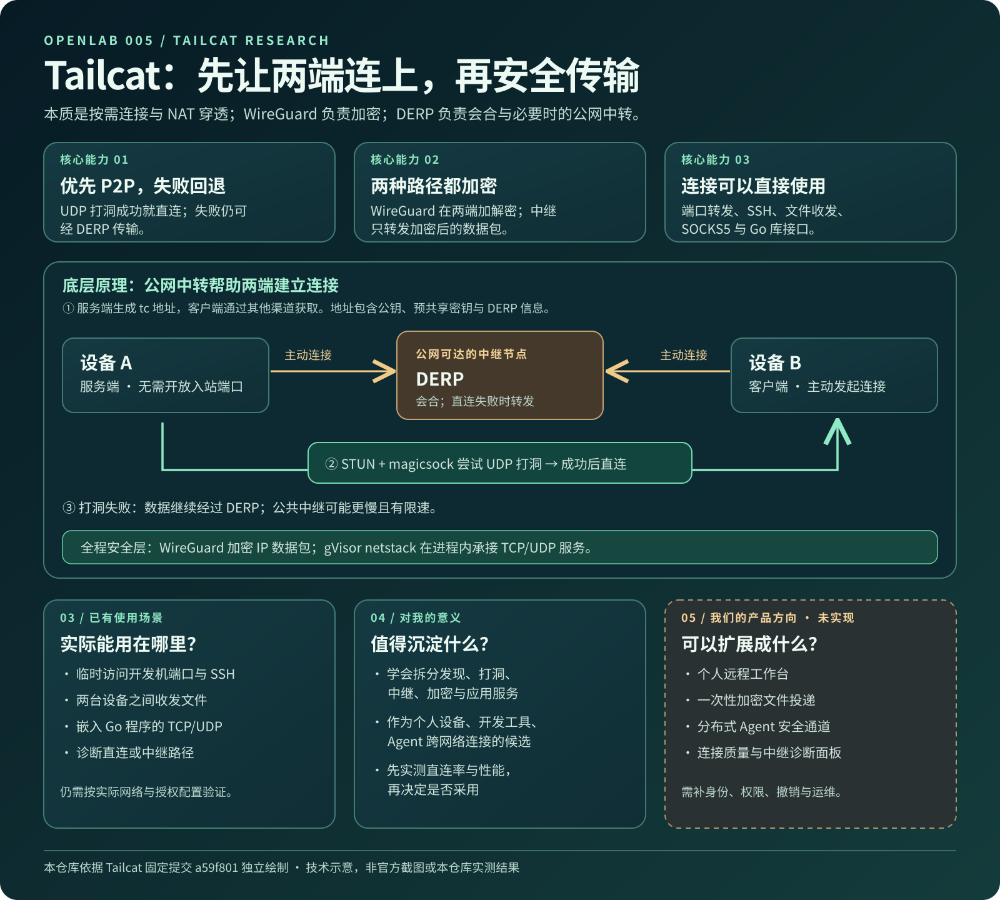](projects/005-tailcat/web/assets/tailcat-understanding.svg)

图：本仓库依据 [Tailcat 固定研究提交](https://github.com/tailscale/tailcat/tree/a59f8011dd8aa5ab9f2445d66c4d4dd94eeaf7f8)、[WireGuard 官方说明](https://www.wireguard.com/)和 [Tailscale DERP 文档](https://tailscale.com/docs/reference/derp-servers)独立绘制；不是原项目截图或实测结果。点击可查看原图。

**能力**：让两台设备在复杂网络下按需连通，优先 P2P 直连，失败时经 DERP 中继；Go 库和 CLI 将连接用于端口转发、SSH、文件服务、SOCKS5、出口节点与诊断。

**底层本质**：把 Tailscale 的数据通道组件组合成无需其控制平面的双端应用连接工具。它的核心是连通能力；WireGuard 是端到端加密层，DERP 是公网会合与必要时的中转层，不保证每次都能直连，也不提供完整的设备管理平台。

**实现原理**：服务端生成包含公钥、预共享密钥和 DERP 信息的 `tc...` 地址，客户端通过带外渠道取得。两端经 DERP 会合并建立 WireGuard 隧道；`magicsock` 借助 STUN 尝试 UDP 打洞，成功后转直连，失败则继续中继；gVisor netstack 在进程内承接 TCP/UDP 服务。

**使用场景**：临时访问远端开发端口、维护自己的设备、跨网络收发文件，或在 Go 应用中嵌入双端传输。实际路径、速度和授权效果仍需在目标网络验证。

**对我们的价值**：它是个人设备、开发工具和分布式 Agent 跨网络连接层的研究候选，也提供清楚的“发现—打洞—中继—加密—服务”分层案例。采用前先用两台设备验证连通率、直连率、延迟、吞吐与权限边界；当前仅完成资料和源码研究。

**可扩展产品方向**：个人远程工作台、一次性文件投递、分布式 Agent 安全通道和连接诊断面板，均为本仓库的设想，需补身份、权限、撤销和运维能力。

默认 `tc...` 地址包含预共享密钥，应按访问凭证保护；对公开地址或高权限服务必须另做客户端认证。上游 Tailcat 包装层仍被标为早期实验工具。原项目采用 BSD-3-Clause；本仓库图片与网页为独立制作。

[原仓库](https://github.com/tailscale/tailcat) · [详细研究](projects/005-tailcat/research.md) · [在线研究网页](https://yydshly.github.io/0928_codex_project/005-tailcat/) · [运行与发布说明](projects/005-tailcat/web/README.md)

### 006 · Personal Edge Proxy

[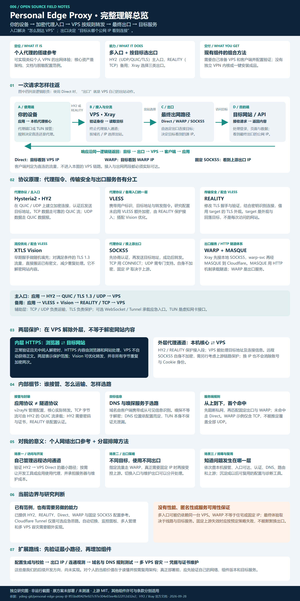](projects/006-personal-edge-proxy/web/assets/personal-edge-proxy-overview.svg)

图由本仓库依据[上游固定研究提交](https://github.com/yding-git/personal-edge-proxy/tree/ff55bdf0429e927c97e304e03ee4b322f12d32e2)的 README 与配置示例独立绘制，不是原项目截图或实测结果。

**库的能力**：提供个人代理的部署文档和脱敏配置示例，支持 HY2 日常入口、VLESS + REALITY + Vision 的 TCP 备用入口，以及按目标域名选择 VPS Direct、Cloudflare WARP 或固定 SOCKS5 出口。客户端可通过代理设置或 TUN 接管应用流量，服务端集中维护出口策略。

**底层本质**：以 VPS 为中转与路由节点，将 Xray、sing-box、现有代理协议和可选上游出口组合成个人网络网关。仓库交付架构经验、文档与配置范例，可用于搭建类似个人 VPN 的出网体验；没有自行实现新的 VPN 内核或提供一键安装成品。

**实现原理**：客户端接住并筛选请求，经 HY2 的 QUIC/UDP 通道或 VLESS/REALITY/Vision 的 TCP 路径送到 VPS；Xray 验证接入并匹配路由，由选定出口连接目标，再把响应沿代理链送回应用。入口决定怎样到达 VPS，最终出口决定目标看到的公网 IP。HTTPS 正常验证时，网站内容仍由应用与网站之间的 TLS 保护；REALITY、Vision、SOCKS5 和 WARP 各有不同职责。

**使用场景**：自建个人出网通道、开发工具和 AI 服务的网络访问、不同目标的出口管理，以及 UDP 不稳定时准备 TCP 备用接入。需要稳定最终 IP 时可按需增加受控固定上游；真实线路质量、域名覆盖和目标可用性仍须验证。

**对我们的价值**：保留为个人网络出口的实施与选型参考，理解客户端接管、协议传输、服务端路由和目标连接的分工；将本机、入口、认证、DNS、路由、出口分层排查。后续可据此开发配置校验、出口观测、规则测试和多 VPS 容灾工具。当前价值在于架构理解与按需复用，尚未证明本机部署收益。

**研究边界**：Cloudflare Tunnel 仅为文档中的可选应急思路，现有示例未包含其配置；WARP 不等于住宅或固定 IP，远程 SOCKS5 自身不提供传输加密。原方案未部署或测速，网页交互仅解释原理。上游采用 MIT，其他组件的许可和服务条件分别核查。

**完整理解展示**：[在线研究网页](https://yydshly.github.io/0928_codex_project/006-personal-edge-proxy/)支持切换 HY2 / REALITY 入口、三类出口和五个请求阶段，解释本机接管、认证分流、目标连接及响应返回；同时整理 DNS、HTTPS、应用协议与隧道协议的区别，以及对个人访问、开发、排障和后续工具的价值。网页仅演示概念，已验证桌面和手机显示，并于 2026-09-28 确认线上页面、交互及图片可用。引导图采用我们生成的完整总览图，提供 SVG 与 PNG，可放大阅读或保存。

[原仓库](https://github.com/yding-git/personal-edge-proxy) · [详细研究](projects/006-personal-edge-proxy/research.md) · [在线研究网页](https://yydshly.github.io/0928_codex_project/006-personal-edge-proxy/) · [完整总览图](projects/006-personal-edge-proxy/web/assets/personal-edge-proxy-overview.svg) · [运行与发布说明](projects/006-personal-edge-proxy/web/README.md)

### 007 · OSINT 资源地图

[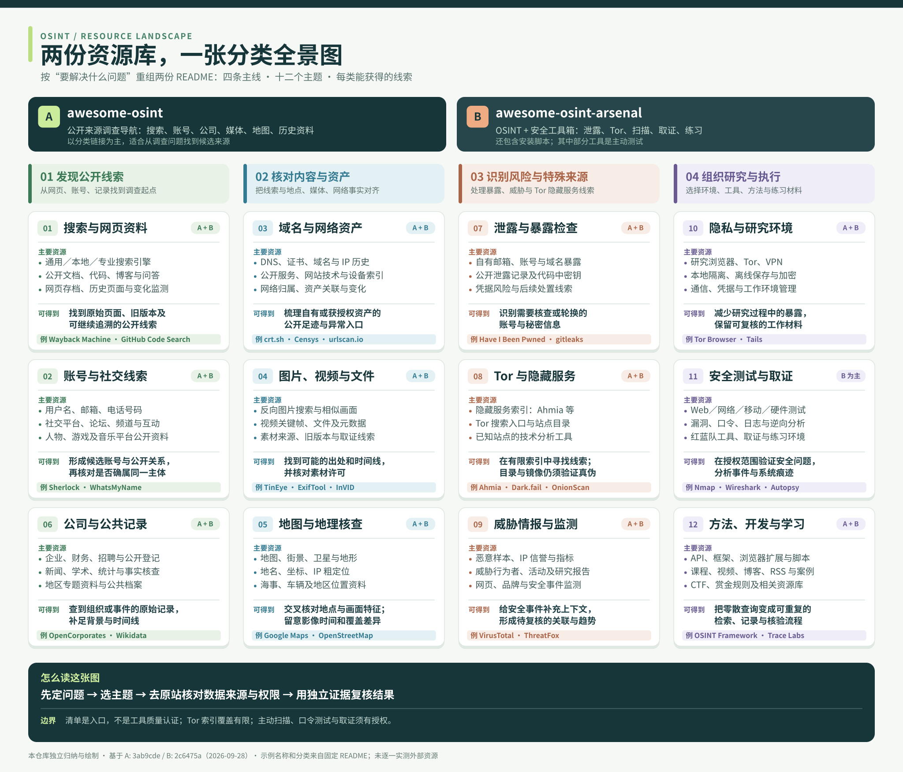](projects/007-osint-resource-map/web/assets/resource-overview.svg)

图由本仓库依据 [awesome-osint 固定提交](https://github.com/jivoi/awesome-osint/tree/3ab9cde5d0f638de91bc86147db6996472d927c6) 与 [awesome-osint-arsenal 固定提交](https://github.com/rawfilejson/awesome-osint-arsenal/tree/2c6475a1d5b941cc598b3612419ef22e6d903ce8)的 README 独立绘制，不是上游截图或工具实测结果。

**能力与价值**：两个仓库都主要收集外部资源。前者按搜索、账号、公司、域名、媒体、地图等公开来源领域提供分类导航；后者还有安装脚本，范围延伸至泄露、Tor、威胁情报、安全测试、取证和练习。它们适合发现候选工具与资料来源。把这些入口按任务重组，逐步加入操作卡、资源状态和结果记录，值得做成自己长期使用的研究入口；这仍需逐项核验原站和数据。

**当前网页**：[分类网页](projects/007-osint-resource-map/web/index.html)用总览图展示四条主线和 12 个任务主题，另有结合本仓库工作推断的 6 类易忽略能力、48 条重点资源中文说明，以及按名称、来源、分类搜索的固定版本索引。暗网第 12 节被拆为搜索入口、链接目录等类型。自动查询、任务操作卡和个人记录尚未实现。

**研究边界**：只核对两份 README、仓库结构及许可，没有逐一测试外部链接、运行安装脚本或访问隐藏服务。第一个仓库采用 CC BY-SA 4.0，第二个采用 MIT；第三方工具与站点各有自己的条款。研究网页及总览图已于 2026-09-28 验证可访问。

[在线研究网页](https://yydshly.github.io/0928_codex_project/007-osint-resource-map/) · [子项目概览](projects/007-osint-resource-map/README.md) · [分类对照与详细研究](projects/007-osint-resource-map/research.md) · [上游 A](https://github.com/jivoi/awesome-osint) · [上游 B](https://github.com/rawfilejson/awesome-osint-arsenal)

### 008 · AI Money Maker Handbook

[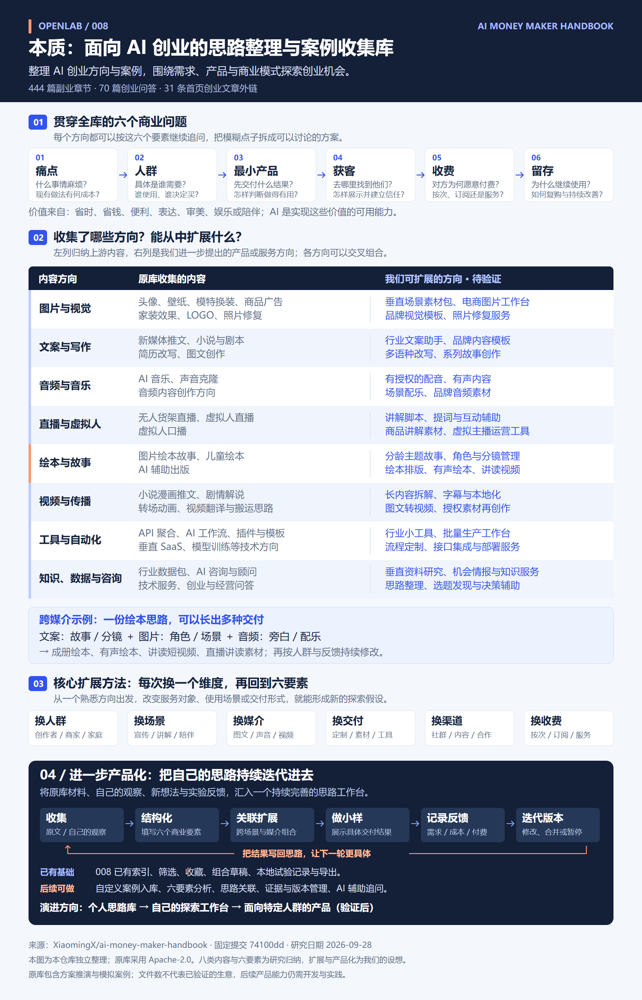](projects/008-ai-money-maker-handbook/web/assets/idea-map.svg)

图由本仓库依据[上游固定研究提交](https://github.com/XiaomingX/ai-money-maker-handbook/tree/74100dd291cbcec4438e1ca3eb5219c47a92a7d3)与本次讨论独立绘制；汇总库的本质、六个商业要素、八类内容与我们的产品化设想，不是原项目截图或经营成果。

**库的本质与价值**：面向 AI 创业的思路整理与案例收集库，目标是帮助探索 AI 创业方向、需求、产品与商业模式。汇集方向清单、444 篇副业章节和 70 篇创业问答，围绕痛点、人群、最小产品、获客、收费与留存组织生意思考。收集内容涉及图片、文案、音频、直播、绘本、视频、工具自动化和知识数据咨询，帮助扩展可能性。

**网页整理**：提供七类能力归纳、完整 514 篇标题与固定原文索引、搜索筛选收藏、思路组合、个人需求与验收记录、成本估算、进度记录及 Markdown 导出。网页没有接入在线 AI，个人草稿只保存在当前浏览器，可导出后继续对话。

**对我的价值**：值得持续整理并产品化，作为自己的 AI 产品化探索入口：借案例打开方向，把个人想法、需求观察、小样与反馈积累下来，逐步形成自己的判断。后端开发与 AI 使用经验可支持工具自动化，也可支撑图文、音频、直播、绘本等创作流程；三个初始服务切口只是起点，需求与成交仍待实践。

**进一步产品化**：可把自己的观察、想法与反馈持续入库，按六要素结构化、关联相似方向、做小样并保留迭代版本，逐步形成个人思路工作台。这是后续开发方向，尚未实现全部能力。见[一图完整理解](projects/008-ai-money-maker-handbook/understanding.md)。

**来源与边界**：固定版本含模拟案例和收益推演；抽读原文与全量标题索引不等于逐篇实证。定时工作流只更新时间戳。上游采用 Apache-2.0；图示、页面与个人探索方法为本仓库独立制作。网页已发布并验证，实际经营方向与后续产品化功能仍待实践。

[在线研究网页](https://yydshly.github.io/0928_codex_project/008-ai-money-maker-handbook/#map) · [详细研究](projects/008-ai-money-maker-handbook/research.md) · [个人价值记录](projects/008-ai-money-maker-handbook/personal-value.md) · [原仓库](https://github.com/XiaomingX/ai-money-maker-handbook)

### 009 · Jev Ultrafast

[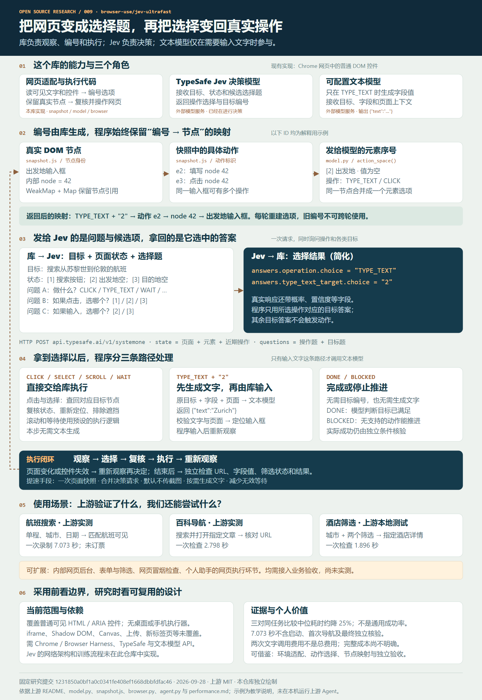](projects/009-jev-ultrafast/web/assets/overview.svg)

图由本仓库依据 [Jev Ultrafast 固定研究提交](https://github.com/browser-use/jev-ultrafast/tree/1231850a0bf1a0c0341fe408ef1668dbbfdfac46) 的 README、源码与测量数据独立绘制；不是原项目截图或本仓库运行结果。

**能力与原理**：库提取当前网页可见 HTML / ARIA 控件并编号，维护真实 DOM 节点、动作 ID 和模型元素序号的对应关系，把任务目标、页面状态及候选选择题交给 TypeSafe Jev。Jev 一次请求返回操作与目标选择，由程序映射、复核并执行。只有输入文字时额外调用文本模型生成字段值；Jev 已经是决策模型，其结果通常直接进入执行器。支持点击、输入、下拉选择、滚动和等待，未提供桌面软件或手机执行器。

**价值**：通过一次页面快照、合并操作与目标决策、按需生成文字，压缩网页任务的处理时间；同时提供可观察、可拆解的浏览器智能体案例，帮助理解如何把模型选择可靠地连接到真实页面。

**使用场景**：上游已检查航班查询、指定百科文章导航和本地酒店搜索筛选。内部网页后台、普通表单、多条件筛选、网页流程检查和个人助手的网页执行环节是进一步可尝试的方向，仍需完成控件适配、权限管理、异常恢复与独立验收。

**对我的意义**：结合已有后端开发和 AI 工具使用经验，可将它作为网页自动化能力的研究起点，沉淀页面适配、受限动作选择、节点映射和结果核验；待遇到真实重复任务时，再评估做成自己的工具或交付方案。当前价值是技术理解与选型参考，需求、效果和收益尚待实践。

**作者报告的效果**：一次 Google Flights 搜索录制为 7.073 秒；同任务三对交替运行，新版中位 7.092 秒，旧版 9.450 秒，两组各 3/3 通过。计时不含浏览器启动、初次导航和最后独立验收，样本不足以证明跨网站通用成功率或最低总费用。

**场景演示与价值**：[在线研究网页](https://yydshly.github.io/0928_codex_project/009-jev-ultrafast/)提供完整原理图、角色分工与编号映射、可切换的请求返回说明，以及航班、百科和酒店三个场景的步骤模拟。另列内部后台、网页流程检查和个人助手的扩展方向及运行前提。这些是本仓库独立编写的教学说明；具体理解见[讨论汇总](projects/009-jev-ultrafast/understanding.md)。采用前仍需在自己的网页上测试完整速度、成功率与成本。

上游采用 MIT 许可；网页与图均由本仓库独立制作。上游 Agent 尚未在本机运行，Shadow DOM、iframe、Canvas、上传和新标签页等目前不在其 MVP 覆盖范围。已发布至 `/0928_codex_project/009-jev-ultrafast/`；2026-09-28 已验证线上页面、首页入口、三种尺寸下的交互以及原引导图。

[原仓库](https://github.com/browser-use/jev-ultrafast) · [子项目概览](projects/009-jev-ultrafast/README.md) · [详细研究](projects/009-jev-ultrafast/research.md) · [在线研究网页](https://yydshly.github.io/0928_codex_project/009-jev-ultrafast/) · [运行与发布说明](projects/009-jev-ultrafast/web/README.md)

### 010 · AntV Infographic

[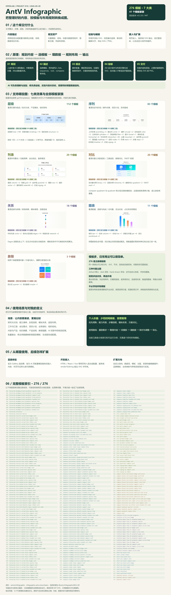](projects/010-antv-infographic/web/public/assets/infographic-overview.svg)

图：2026-09-28 本仓库独立编排的完整能力总览。固定版本 `@antv/infographic@0.2.20` 的 276 个模板名称和 41 个家族均由安装包读取，七类缩略图来自原库实际运行。包含内容、原理、类型、场景与个人价值；完整清单不表示全部模板都经过效果验证。[下载高清 PNG](projects/010-antv-infographic/web/public/assets/infographic-overview.png)。

**能力**：把结构化的文字、数值和关系转换为图表或信息图，包括流程、列表、层级、关系、对比、数值图表和象限；支持主题、画布编辑与 SVG／PNG 导出。固定版本含七类、276 个模板；演示页直接运行七个代表模板。

**价值**：复用布局与视觉组件，减少重复排版，让重点、先后、归属、差异和数量更容易理解。

**使用场景**：开源研究配图、教程流程、知识摘要、产品说明、方案对比和报告；业务数据映射后还可用于批量出图。

**原理**：按内容要表达的类型选模板，再填入符合要求的数据；模板指定使用哪些结构、数据项组件及参数，程序按注册名称查找实现、组合组件并计算布局，最终生成 SVG。类型帮助选方案，模板组合绘图能力；编辑器插件通过初始化与销毁接入交互，属于另一层扩展机制。

**对我的意义**：当前保留为按需取用的绘图工具，优先用熟能力列表、步骤流程、模块关系与方案对比。后期深入研究其注册机制、组件组合与插件生命周期，借鉴到可插拔的产品设计及相关产品方案，例如模板化报告工具、业务组件工作台和可扩展编辑器。先完成运行追踪、自定义卡片、自定义布局与编辑器插件四个实验，再结合真实需求设计产品；实验和产品方案均待探索。

**网页汇总**：同一页面在实时演示下方设置五部分研究总结，依次说明能力、效果、原理、适用场景和扩展方向；另提供 276 个模板的七类索引与搜索、日常选图建议和使用入口，并标明已验证范围与上游资料来源。

本机已验证七类内置模板、主题切换、编辑开关、流式重播与两种导出。2026-09-28 已完成 GitHub Pages 部署，公开网页中的七类渲染、五项摘要、完整模板数量和架构章节已核验。示例数据和页面界面由本仓库编写，原库采用 MIT 许可。

[原仓库](https://github.com/antvis/Infographic) · [子项目概览](projects/010-antv-infographic/README.md) · [详细研究](projects/010-antv-infographic/research.md) · [在线研究网页](https://yydshly.github.io/0928_codex_project/010-antv-infographic/) · [演示运行说明](projects/010-antv-infographic/web/README.md)

### 011 · vphone-aio

[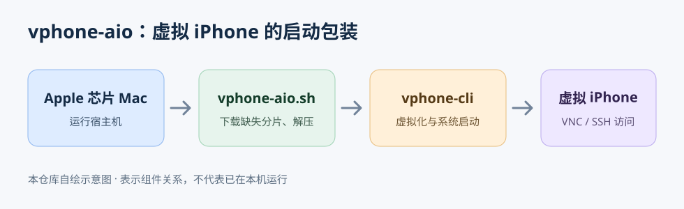](projects/011-vphone-aio/assets/vphone-aio-flow.svg)

图由本仓库依据 [vphone-aio 固定研究提交](https://github.com/34306/vphone-aio/tree/1db79dccd95391d6247c41f3cc4eac523567f295) 独立绘制，仅表示组件关系；不是原项目截图或本机运行结果。

**能力与原理**：这是面向 Apple 芯片 Mac 的虚拟 iPhone 整合包。脚本检查依赖、下载缺失的归档分片、合并解压预制环境，调用其中的启动脚本，并将 VNC 与 SSH 转发到本机。真正的虚拟化和固件处理能力主要来自上游 `vphone-cli`；本整合包对应 iOS 26.1 的预装越狱环境。

**场景与价值**：可用于 iOS 调试与研究环境的快速准备。对本仓库主要是“用脚本封装复杂上游能力”的案例，简要收录后按需参考，暂不深入。当前 Windows 环境未运行原版，兼容性和实际效果未验证；若将来需要使用或自动化，优先评估持续更新的上游项目。原仓库未见独立 LICENSE，不能把上游 MIT 许可直接套用于整合包与预制材料。

[原仓库](https://github.com/34306/vphone-aio) · [子项目概览](projects/011-vphone-aio/README.md) · [简要研究记录](projects/011-vphone-aio/research.md) · [上游项目](https://github.com/Lakr233/vphone-cli)

## 仓库结构

```text
projects/
  001-storm-breaker/
    README.md          # 项目概览与来源
    research.md        # 研究记录、复现和结论
    assets/            # 自制图片或注明来源的研究截图
    web/               # 可选：独立网页的源码
  002-airi/            # AIRI 能力地图、角色表现与交互研究
  003-grokbot-field-notes/ # Thursday Arena 产品与直播问题、Agent 工作方法研究
  004-ace-step-ui/     # ACE-Step UI 音乐创作能力展示与研究
  005-tailcat/         # 加密 P2P 连接、NAT 穿透与中继回退研究
  006-personal-edge-proxy/ # 个人代理入口与出口分层研究
  007-osint-resource-map/ # 两份 OSINT 资源清单的对照、暗网分类说明与自绘地图
  008-ai-money-maker-handbook/ # 思路库研究、资料索引与个人首单探索网页
  009-jev-ultrafast/ # 快速网页智能体研究与场景教学模拟
  010-antv-infographic/ # 直接调用原库的信息图能力展示与研究
  011-vphone-aio/ # Mac 虚拟 iPhone 启动整合包的简要研究
templates/project/     # 新子项目模板
docs/                  # 索引与网页发布约定
```

子项目可以采用不同技术栈，彼此独立。多个网页使用各自的部署子路径；目录命名、图片使用和发布约定见[项目维护说明](docs/CONVENTIONS.md)。

## 添加研究项目

1. 取下一个未使用的三位编号，并为目录取简短的英文名称，例如 `projects/002-example/`。
2. 复制 [子项目模板](templates/project/README.md) 和 [研究记录模板](templates/project/research.md)，填写真实来源与研究内容。
3. 将图片放在该项目的 `assets/` 中，写明图片来源或制作方式。
4. 在上方索引按编号增加一行，并在索引后添加对应图文摘要；有演示时补上链接。
