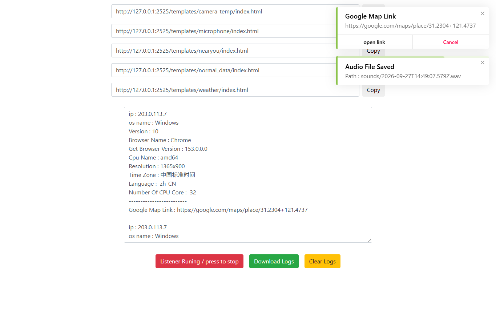

# 开源项目研究索引

这里集中记录值得深入研究的 GitHub 项目。每个子项目保留原仓库链接、研究问题、复现过程、个人结论与图片；需要交互展示时，可以再增加独立的网页演示。

本仓库记录的是研究和实践过程。原项目的代码、图片和名称归各自作者所有；引用或改编时，在对应子项目中注明来源与许可。

## 子项目索引

编号按加入顺序分配，从 `001` 开始。编号一经使用便保持不变，后续研究更新原条目即可。

| 序号 | 子项目 | 研究重点 | 原仓库 | 演示 | 进度 |
| :---: | --- | --- | --- | --- | --- |
| 001 | [Storm-Breaker 能力与原理研究](projects/001-storm-breaker/README.md) | 位置、摄像头、麦克风与环境信息的浏览器采集链路；按需扩展场景 | [ultrasecurity/Storm-Breaker](https://github.com/ultrasecurity/Storm-Breaker) | [在线研究网页](https://yydshly.github.io/0928_codex_project/001-storm-breaker/) | 已发布；原版已本机复现；音频落盘未证实 |

### 001 · Storm-Breaker



**基础能力：**Storm-Breaker 把五套主题网页、浏览器环境信息读取、位置与摄像头/麦克风权限请求、PHP 接收和管理面板串成一条采集与结果展示链路。精确位置和媒体输入都受浏览器授权约束；它本身不提供访客间位置共享、现场记录工作流或实时协作。本子项目已在本机运行原仓库的面板和模板，用虚拟设备验证文本、模拟位置和摄像头图片的回传；音频只有面板通知，文件落盘未证实。

**研究价值与扩展：**这一案例帮助看懂浏览器权限及前后端数据流，辨别网页诱导授权，并用实测核对功能宣称。安全教育可在授权环境中演示；现场记录、限时位置共享、远程协作是基于位置和音视频能力的探索方向，需要按真实需求补齐同意、时效、撤销、访问控制与可靠保存。基础能力并不自动构成有价值的产品。下图是原版面板的虚拟测试截图，使用示例 IP、模拟位置和虚拟媒体设备。

[原仓库](https://github.com/ultrasecurity/Storm-Breaker) · [一图总览](projects/001-storm-breaker/assets/storm-breaker-understanding.svg) · [研究记录](projects/001-storm-breaker/research.md) · [原版运行说明](projects/001-storm-breaker/README.md#原版效果) · [在线原版效果与原理展示](https://yydshly.github.io/0928_codex_project/001-storm-breaker/)

## 仓库结构

```text
projects/
  001-storm-breaker/
    README.md          # 项目概览与来源
    research.md        # 研究记录、复现和结论
    assets/            # 自制图片或注明来源的研究截图
    web/               # 可选：独立网页的源码
templates/project/     # 新子项目模板
docs/                  # 索引与网页发布约定
```

子项目可以采用不同技术栈，彼此独立。将来若发布多个网页，为每个演示分配独立路径，并在索引和子项目 README 中放入实际可访问的链接。目录命名、图片使用和发布约定见 [项目维护说明](docs/CONVENTIONS.md)。

## 添加研究项目

1. 取下一个未使用的三位编号，并为目录取简短的英文名称，例如 `projects/002-example/`。
2. 复制 [子项目模板](templates/project/README.md) 和 [研究记录模板](templates/project/research.md)，填写真实来源与研究内容。
3. 将图片放在该项目的 `assets/` 中，写明图片来源或制作方式。
4. 在上方索引按编号增加一行，并在索引后添加对应图文摘要；有演示时补上链接。
