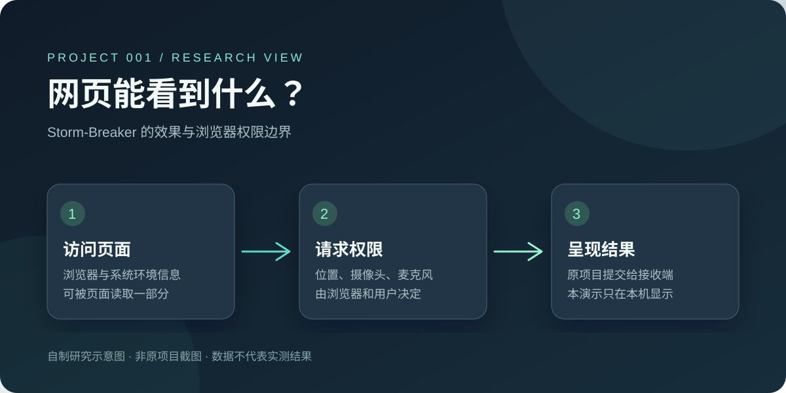
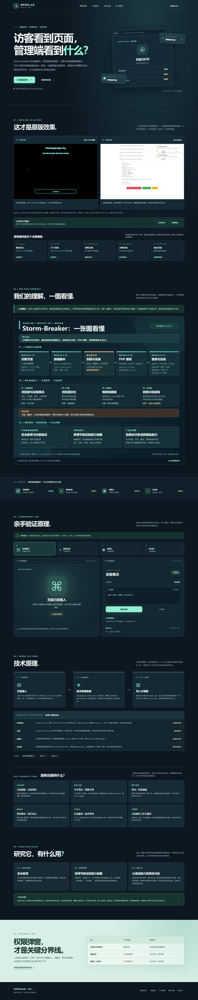

# 001 · Storm-Breaker 原版复现

Storm-Breaker 是一个将主题网页、浏览器信息读取、位置及摄像头/麦克风权限请求、PHP 回传和管理面板组合起来的社工工具。它展示的是浏览器能力的采集与结果呈现链路，不是附近人匹配或位置共享产品。本子项目以**运行原仓库自带的页面和面板**为主，另有独立制作的原理说明页。

| 项目资料 | 链接或说明 |
| --- | --- |
| 原仓库 | [ultrasecurity/Storm-Breaker](https://github.com/ultrasecurity/Storm-Breaker) |
| 原作者 / 组织 | ultrasecurity 及原仓库贡献者 |
| 研究版本 | [`4d7235104870ec0224f445fd905c98f22a105426`](https://github.com/ultrasecurity/Storm-Breaker/tree/4d7235104870ec0224f445fd905c98f22a105426)（`main`，2024-10-12 的提交；2026-09-27 查阅） |
| 研究状态 | 原版面板与模板已在本机运行；音频落盘未成功验证 |
| 在线演示 | 暂无；尚未发布公网地址 |
| 原版本机运行 | [准备脚本](prepare-original.ps1) · [启动脚本](run-original.ps1)；见下方步骤 |
| 补充原理演示 | [独立制作的交互说明页](web/index.html) |
| 研究记录 | [research.md](research.md) |



图片来源：本仓库自制 SVG 示意图，根据原仓库公开文档及源码整理；不是原项目截图，也不是实际采集结果。

## 原版效果

原仓库在 `storm-web/` 中提供 PHP 管理面板和 `camera_temp`、`microphone`、`nearyou`、`normal_data`、`weather` 五套页面模板。我们以提交 `4d7235104870ec0224f445fd905c98f22a105426` 运行了这些**原版文件**：面板可列出五条模板地址；虚拟浏览器访问模板后，面板收到了设备信息、模拟坐标、虚拟摄像头图片和音频“已保存”通知。摄像头图片确实落盘；Windows 下没有找到对应的音频文件，因此不能把音频通知当成保存成功的证明。具体证据和限制见 [研究记录](research.md#复现过程)。


图片来源：本仓库在 Windows 本机运行所研究提交的**原版管理面板**，用虚拟浏览器与虚拟设备生成测试结果后自行截图。原版界面来自 [ultrasecurity/Storm-Breaker](https://github.com/ultrasecurity/Storm-Breaker)，其仓库未见明确 `LICENSE` 文件；此图仅用来记录研究过程，不代表获得原项目界面的再利用许可。图中的音频通知不等于文件落盘成功。

[原版 Near You 访客页面截图](assets/original-nearyou-local.png)也由本仓库在同一本机服务中截取；截图发生在点击 Continue 之前，没有请求真实位置，未使用个人数据。其界面来源及许可限制与上图相同。

在 Windows PowerShell 中进入本子项目目录后运行：

```powershell
.\prepare-original.ps1
.\run-original.ps1
```

准备脚本把原仓库固定提交下载到被 Git 忽略的 `upstream/`，并把已校验的官方便携 PHP 下载到被 Git 忽略的 `.runtime/`。这些内容保留在本子项目内，不复制进本仓库历史。启动脚本直接运行原仓库的 `storm-web/`，仅监听 `127.0.0.1:2525`，按 `Ctrl+C` 停止；也可运行 [停止脚本](stop-original.ps1)。运行期间在浏览器打开 `http://127.0.0.1:2525/`；本地面板沿用原版默认账号 `admin` / `admin`。此地址只在服务运行的本机可用，不是公网演示。

原版页面会向第三方查询 IP，面板会向 GitHub 检查更新，并把收到的内容写到原仓库的 `storm-web/` 下。我们的自动化验证使用示例 IP、模拟坐标及虚拟媒体设备，并拦截了对外请求；直接用自己的浏览器打开原版页面时，仍会执行原项目自身的请求和写入逻辑。

## 补充原理演示

独立网页把原版访客页与管理页的实测截图放在开头，在本机可打开五套原版模板，并逐项说明环境信息、位置、摄像头和麦克风的实现路径。完整能力清单还覆盖模板链接、PHP 接收、面板通知与日志操作、本地启动和版本检查；更详细的源码盘点见[研究记录](research.md#完整能力清单所研究提交)。页面区分原库已具备的基础能力与按需开发的场景：授权环境中的安全教育可直接演示；现场记录、限时位置共享和远程协作需要独立设计同意、时效、撤销、权限与保存机制，均非原库现成产品。下半部的交互实验由本仓库自行编写，不是原项目界面。


图片来源：本仓库根据所研究提交的源码及本机虚拟设备复现结果自行绘制；**不是原项目截图**。网页使用 `web/assets/` 中的同图副本，便于独立静态托管。图中的音频保存状态按测试结果标为“未证实”。



图片来源：本仓库自行制作的[原理说明页](web/index.html)，在本地浏览器中截取的完整页面；其中访客页与管理面板区域嵌入了上文注明来源的原版实测截图，交互实验区域为本仓库独立制作的默认样例状态。

## 为什么研究

这个案例可以直观区分「打开网页后可读取的部分环境信息」与「必须经过浏览器授权的精确位置、摄像头和麦克风」。对我的价值是获得可验证的能力地图：看清网页、浏览器 API、PHP 接收和面板之间的数据流，识别诱导授权，分清请求、通知与真正保存的结果。通用定位和音视频已有成熟产品；扩展价值取决于具体任务与流程中的真实痛点。

## 研究摘要

原项目提供多个页面模板，前端 JavaScript 读取环境信息并调用浏览器定位或媒体 API，PHP 接收并保存数据，Python 启动本地 PHP 服务。浏览器权限不会被该项目绕过。[原仓库 README](https://github.com/ultrasecurity/Storm-Breaker) 与 [源码索引](https://github.com/ultrasecurity/Storm-Breaker/tree/main/storm-web)。

本仓库另附的原理说明页是**独立制作的研究展示**：默认使用明确标注的样例数据；访问者可主动进行本机验证，数据只呈现在当前页面，没有上传接口、第三方请求或持久化。它与上面的原版复现是两个不同入口。

## 演示与运行

原版运行方式见「原版效果」。若要查看独立的原理说明页，在 `web/` 目录启动静态文件服务器；详见 [运行说明](web/README.md)。该静态页计划的部署子路径是 `/0928_codex_project/001-storm-breaker/`，**目前尚未发布**；原版 PHP 页面不能由纯静态的 GitHub Pages 直接运行。

## 图片、参考与许可

- 本仓库 `assets/cover.svg` 与 `assets/storm-breaker-understanding.svg` 为自制图；`assets/demo-desktop.png` 是现行研究网页的完整截图；`assets/original-nearyou-local.png` 和 `assets/original-panel-virtual-test.png` 是注明来源的原版运行截图。原版复现的代码在被 Git 忽略的 `upstream/` 中，由脚本从原仓库获取。
- 原项目代码与名称归原作者及贡献者所有。所研究的仓库根目录未见明确的 `LICENSE` 文件；不能据此推定可自由复制或再分发原项目内容。后续若引用原项目素材，需先核实对应许可。
- 浏览器权限边界参考 [MDN getUserMedia](https://developer.mozilla.org/en-US/docs/Web/API/MediaDevices/getUserMedia) 与 [MDN Geolocation API](https://developer.mozilla.org/en-US/docs/Web/API/Geolocation_API)。
