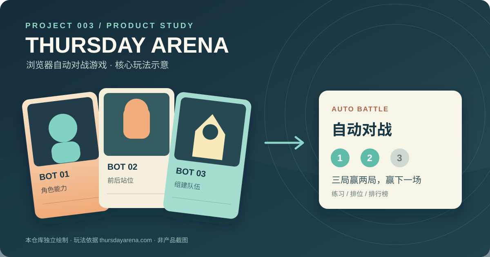

# 003 · Grok Bot Field Notes 工程经验与使用参考

`grokbot-field-notes` 是 `unicodef1wn` 对三名工程师直播开发产品的第三方整理。工程师使用 Grok Bot Agent 协助工作；不是 Grok Bot 控制直播推流。直播最终做出的产品叫 **Thursday Arena**，是一款浏览器自动对战游戏。首日尝试快闪活动方向，第二天改做游戏，第三天公开上线。本子项目把产品、遇到的问题、处理动作、可迁移经验和资料库本身的工作模板分开展示。

| 项目资料 | 链接或说明 |
| --- | --- |
| 原仓库 | [unicodef1wn/grokbot-field-notes](https://github.com/unicodef1wn/grokbot-field-notes) |
| 直播做出的产品 | [Thursday Arena 当前官网](https://thursdayarena.com/)；当前页面内容不能反推直播当天所有功能 |
| 原作者 | `unicodef1wn`；其资料整理与 xAI 的 Grok Bot 产品实现应分别看待 |
| 固定研究提交 | [`02780c04ef5f412b28573bce6f82afd15d195d1f`](https://github.com/unicodef1wn/grokbot-field-notes/tree/02780c04ef5f412b28573bce6f82afd15d195d1f)，提交时间 2026-09-20T12:09:19Z |
| 查阅日期 | 2026-09-28 |
| 原仓库许可 | [MIT](https://github.com/unicodef1wn/grokbot-field-notes/blob/02780c04ef5f412b28573bce6f82afd15d195d1f/LICENSE)，版权声明为 Copyright (c) 2026 unicodef1wn |
| 研究状态 | 已核对原仓库文件与固定提交；未安装或运行 Grok Bot 产品 |
| 独立展示网页 | [在线研究网页](https://yydshly.github.io/0928_codex_project/003-grokbot-field-notes/)；[本地源码](web/index.html)；运行说明见 [web/README.md](web/README.md) |
| 详细研究 | [research.md](research.md) |
| 部署与核验 | `/0928_codex_project/003-grokbot-field-notes/`；2026-09-28 已核验公网页面、引导图、交互与手机布局；[部署记录](https://github.com/yydshly/0928_codex_project/actions/runs/36387455024) |

## 全量理解引导图

[PNG 图片](web/assets/understanding-guide.png) · [可缩放 SVG](web/assets/understanding-guide.svg)。本仓库根据固定版本研究和本次讨论独立绘制，非官方图或产品截图。

**投入判断：**对有成熟工程经验的使用者，这些规则多为既有原则在 Agent 场景中的应用，新增方法有限。较有价值的是具体案例、模板和遗漏检查；部分案例缺少完整代码、独立事故报告与长期结果。当前适合归档参考，遇到实际问题再查阅，不必整体照搬或持续深入。

## 六项研究摘要

**库的能力：**提供三天产品开发笔记、失败案例、Agent 工作规则、验证与编排指南、岗位模板、业务流程和成本观察，帮助理解开发过程、设计协作与验收。它交付的是第三方资料与配置素材，不能直接运行 Grok Bot 或复现游戏。

**技术本质：**把工程经验写成 Agent 与人共享的目标、职责、事实来源、工具使用和完成标准；由现有 Agent 平台执行，由项目自己的检查器验证，再将反馈更新到规则。核心是工作约定与反馈机制，未提供新模型、推理算法或运行平台。

**可沉淀技术：**可转化为项目规则与任务输入输出约定、验证命令与证据采集、角色交接与异常升级、PR 验收记录、例行任务成本审查，以及经验证的技能封装。原库主要提供原则和样例；具体工具、程序、权限及测试需要自行适配实现。

**使用场景：**适用于 Agent 辅助编码与缺陷修复、开源项目研究和网页交付、产品原型与上线验收、小规模多 Agent 协作，以及客服、销售、营销等重复工作流程的设计。业务演示需重新接入真实资料和工具，不能直接视为已验证经营效果。

**可扩展方向：**可进一步做成项目验证工具包、开源研究助手技能、带状态记录与人工门槛的协作流程，或工程事故与评估知识库。需要分别补齐检查器、数据接入、执行与重试机制、权限控制及持续评估；这些是我们的迁移方向，尚未实现。

**对我的意义：**对已有工程经验的你，新增方法有限；价值主要在具体案例、模板整理和遗漏检查。当前适合归档参考，降低持续深入优先级。以后遇到研究、Agent 协作或交付验证的问题，再按需查阅、适配并验证，无需整体照搬。

## 我们最终怎样理解这个库

它是一套 **有案例支撑的 Agent 工作方法、操作手册与模板资料库**。三天产品开发是主线，九类岗位演示扩展了工程、产品、销售、客服和营销等应用。作者将过程加工成规则、流程、职责、验收材料和失败经验。部分岗位演示使用虚构公司或账户，不能把演示数字当成真实经营效果。

- **八个内容模块**：逐日笔记、失败案例、工作规则、执行与验证方法、岗位模板、九类岗位流程、成本与产品机制、指南与使用材料。
- **五类沉淀成果**：工作规则、流程方案、岗位模板、验收模板、案例经验。这是本研究按用途作出的归纳。
- **参考价值**：设计 Agent 的职责与边界、组织协作、改进编码和产品交付、设计业务工作流、评估重复运行成本。
- **使用边界**：资料需要结合自己的工具和运行环境适配；具体执行器、记忆、调度、隔离、测试与权限不能由文档自动实现。
- **后期路线**：选一个实际问题 → 适配规则 → 跑通一个完整任务 → 稳定后封装技能或流程 → 根据效果扩展。此路线是迁移建议，尚未安装技能或创建自动运行系统。

对当前项目集，可先完善“研究开源项目 → 整理事实与判断 → 制作网页 → 验证交付”。把输入、输出、事实来源和验收信号明确后，验证重复使用的稳定性，再考虑封装技能或拆分岗位。

## 案例示意

图由本仓库依据 Thursday Arena 当前官网玩法独立绘制，不是原游戏图片、直播截图或 Grok Bot 产品界面；未复制原项目视觉素材。

## 做出的产品与三天路径

Thursday Arena 的基本玩法是选最多三张 bot 卡牌，用每局代币组队，点击对战后自动结算，三局赢两局获胜。当前官网提供无需登录的 AI 练习，以及 X 登录后的排位和排行榜。直播记录还涉及买卖、刷新、冻结卡牌、角色能力与站位。直播当时的实现与现在的官网应分别看待。

| 阶段 | 做了什么 | 暴露的问题 |
| --- | --- | --- |
| 第 1 天 | 从空仓库探索餐饮、艺术、周边等快闪活动，搭出早期落地页 | 目标用户、许可与运营范围反复变化 |
| 第 2 天 | 转向浏览器自动对战游戏，扩展角色、队伍与后端 | 属性不符合规则、刷新机制可刷稀有牌、客户端数据可修改 |
| 第 3 天 | 发布 Thursday Arena，接收玩家使用与反馈 | 排位误匹配 AI、卡牌与移动端显示问题、代币耗尽卡住、错误 SQL 造成生产故障 |

这些事件来自原库作者的[第 1 天](https://github.com/unicodef1wn/grokbot-field-notes/blob/02780c04ef5f412b28573bce6f82afd15d195d1f/notes/day-1-notes.md)、[第 2 天](https://github.com/unicodef1wn/grokbot-field-notes/blob/02780c04ef5f412b28573bce6f82afd15d195d1f/notes/day-2-notes.md)、[第 3 天](https://github.com/unicodef1wn/grokbot-field-notes/blob/02780c04ef5f412b28573bce6f82afd15d195d1f/notes/day-3-notes.md)笔记，属于直播二次整理，不是独立事故报告。上线时记录的 PR、页面浏览和对战次数不能直接证明产品市场匹配；笔记记录直播结束时实际收入为 0。

## 对本仓库的可参考价值

1. 每个研究项目先弄清 **原团队真正交付的产品、目标用户和使用路径**，再讨论使用了什么 Agent 或技术。
2. 区分第三方笔记、产品当前官网与本地实测。重要数字和“已修好”等结论应标记验证边界。
3. 网页展示从陌生访客角度验收：公开链接、部署子路径、窄屏、操作流程与资源加载。
4. Agent 修改高影响功能时先复现、明确验收信号，并设置测试、发布与回滚门槛。

## 能力与技术本质

- **规则和交付标准**：`AGENTS.md`、PR 模板规定复现、实际运行、证据和人工处理事项。
- **验证方法**：`agents/VERIFICATION.md` 讲解稳定的验证命令、功能地图和合并前证明；示例命令需要在具体项目实现。
- **多 Agent 编排**：`agents/ORCHESTRATION.md` 描述窄职责、协调者、共享标准、自主程度和成本管理；`roster/` 提供 69 种角色说明，`playbooks/` 提供 9 类岗位流程。
- **经验回流**：`ANTIPATTERNS.md` 归纳 40 个失败案例；`reference/ECONOMICS.md` 汇总直播中提及的成本与产出数字，其数字属于案例记录，并非普遍性能基准。

技术本质是将目标、权限、事实来源和完成标准写入可复用资料，再由已有 Agent 与工具环境执行，用可复现检查形成反馈。Markdown 文档自身不能提供模型、通用执行器、项目验证程序或真实权限控制。具体依据见 [研究记录](research.md)。

## 工作方法的使用场景

资料库中的规则适用于 AI 辅助开发的任务验收、多 Agent 交接、客服和其他可重复流程的设计。对当前研究仓库，可在既有“编号、原仓库、研究版本、图片来源、许可证、已核实链接”规范上，补充 **关键结论可追溯** 与 **网页实际可验证** 两项完成标准。角色目录按需要选择。

## 网页内容与交互

页面按“理解定位 → 八个内容模块 → 五类沉淀成果 → 参考价值 → 后期使用路线”展开，再展示 Thursday Arena 的玩法、三天产品路径、八个问题、工作机制、场景推演与来源。八个模块可展开阅读，场景可切换。交互只展示固定说明内容，不调用模型或运行原项目。

网页为独立的 HTML、CSS、JavaScript 和自制 SVG，所有源码与资源位于本项目 `web/` 目录，无第三方运行依赖或构建步骤。站点打包约定将 `web/` 放到 `/0928_codex_project/003-grokbot-field-notes/`。已部署至 [GitHub Pages](https://yydshly.github.io/0928_codex_project/003-grokbot-field-notes/)，2026-09-28 核验通过。

## 图片与许可

- `web/assets/understanding-guide.svg` 与 `.png`：本仓库自绘的全量理解引导图；SVG 为可缩放源图，PNG 为其渲染导出。
- `web/assets/field-notes-map.svg`：本仓库独立绘制的研究示意图，不是原项目截图。
- `web/assets/thursday-arena-study.svg`：本仓库依据当前游戏官网玩法独立绘制的游戏机制示意图，不是原产品截图。
- 本展示没有复制原仓库 PDF、文字长段落、产品界面或其他第三方图片。原仓库与 Grok Bot 产品、品牌的权利分别归其权利人所有。
- 原仓库 MIT 许可适用于其所授权的资料；本项目的分析和网页设计是本仓库的独立工作。
