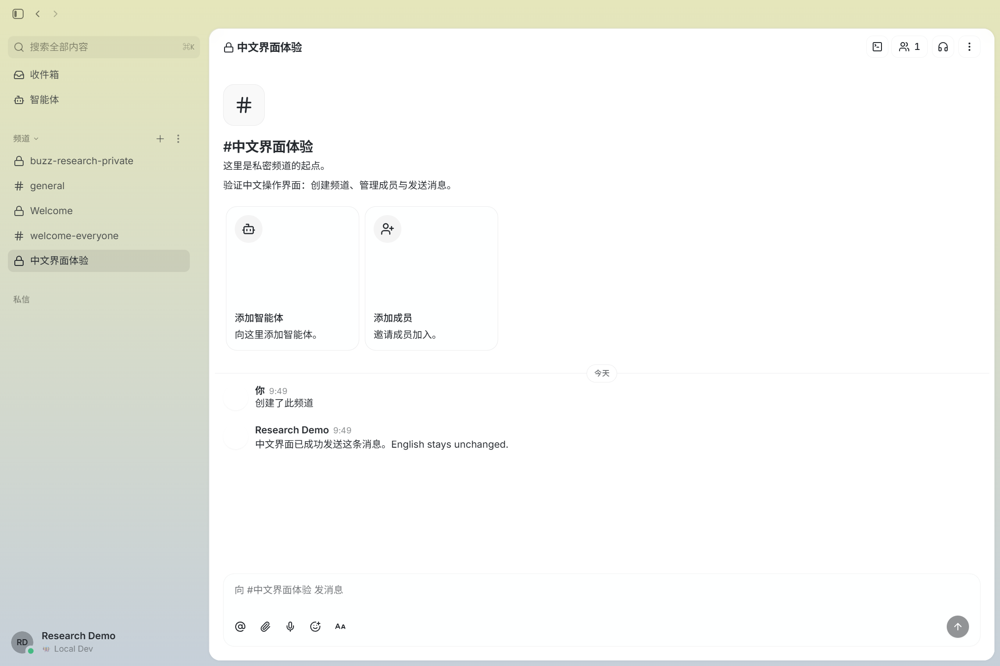

# 012 · Buzz：人与 Agent 的协作工作区

> Buzz 是供人和 Agent 共同使用的自建协作平台：可配置 Agent 的独立身份、职责与能力，让它以成员身份加入频道；relay 负责签名验证、成员权限、消息存储和推送，Agent 接入进程再按授权与规则调用模型和工具。本机已验证私密频道、身份、消息、讨论串及中文界面，尚未验证模型自动执行。适用于项目、研发、客服与内部业务协作；对我们的价值是参考这套机制，进一步设计“定制 Agent + 统一运行服务 + 平台连接器”，把能力交付到其他群聊、会议或业务系统，后者仍需开发与验证。

[](web/assets/buzz-overview.svg)

图：沿用本仓库生成的完整能力总览，非上游截图。固定源码、原版截图与本机实测分别标注；上游采用 Apache-2.0，许可见 [UPSTREAM-LICENSE.txt](web/UPSTREAM-LICENSE.txt)。

| 项目资料 | 链接或说明 |
| --- | --- |
| 原仓库 | [block/buzz](https://github.com/block/buzz) |
| 原作者 / 组织 | [Block, Inc.](https://block.xyz/) |
| 固定研究版本 | [`ebe99a46`](https://github.com/block/buzz/tree/ebe99a46e8802b9ff20fdf6a1028ce93bdefaa43) |
| 上游许可 | [Apache License 2.0](https://github.com/block/buzz/blob/ebe99a46e8802b9ff20fdf6a1028ce93bdefaa43/LICENSE) |
| 原版运行 | 本机已启动从固定源码编译的 relay 与官方 `0.5.25` Windows 桌面版；[运行与实测记录](runtime.md) |
| 中文版 | 已从源码编译本地中文修改版，支持中英文切换；[启动和使用说明](localization/README.md) |
| 效果展示 | [打开本地展示页](web/index.html)；上游、原版实测与中文版截图分别标注 |
| 在线研究页 | 正在准备发布；网页展示研究与真实截图，Buzz 运行服务仍在本机 |
| 研究记录 | [research.md](research.md) |

## 一张图完整理解

[放大顶部引导图](web/assets/buzz-overview.svg)

本仓库原创研究图，2026-09-29 根据固定源码与本机验证绘制，非官方宣传图。图中标明已实测与待接入的能力；[完整汇总](understanding.md) · [网页总览](web/index.html#overview)。

## 新增：可实际操作的中文版

双击本目录的 **`启动 Buzz 中文版.cmd`**，进入“中文界面体验”频道。左下角头像 → 设置 → 外观 → 界面语言，可切换简体中文和 English。频道、身份、聊天、智能体配置与常用设置已加入中文文案，部分高级界面仍保留英文。它是本仓库基于上游源码制作的本地修改版；[范围、实现与验证记录](localization/README.md)。



图：2026-09-29 本仓库截取的真实中文客户端画面，非上游官方发布图。

## 一句话理解：带 Agent 的自建群聊工作区

你的理解基本正确：**Buzz 可以创建相互分开的频道，让成员在频道里聊天、发起话题、回复，也可以把 Agent 加进来互动。** 它的组织层级是：

```text
一个工作区（由 relay 地址确定）
  ├─ 开放频道：可搜索，成员可自行加入
  ├─ 私密频道：隐藏，需邀请加入
  ├─ Stream：像群聊一样连续发消息、回复成讨论串
  ├─ Forum：按主题发帖，逐条评论
  └─ 私信：成员之间单独交流
```

例如，创建一个私密的「产品改版」频道，邀请两位同事和一个已配置的 Agent。你发“首页转化下降，先整理最近的改动和讨论”。同事可以回复；你也可以 `@Agent`，让它在有权限的历史和工具范围内检索、整理并回复。讨论、Agent 回复和后续处理记录留在频道中，之后可以搜索。Agent 能否真正查代码或执行任务，取决于是否配置了 Agent 进程、工具与相应权限。

这里的“隔离”主要是**工作区与频道成员权限隔离**：自建部署下一个 relay 地址对应一个工作区，私密频道只向有访问权限的成员开放。事件签名用于核验作者和完整性；不能仅凭“私密频道”推断为端到端加密。频道类型与可见性见上游 [`channel.rs`](https://github.com/block/buzz/blob/ebe99a46e8802b9ff20fdf6a1028ce93bdefaa43/crates/buzz-core/src/channel.rs)。

## 我们形成的理解：房间、消息与业务执行

**通信底座就是房间管理 + 身份与权限 + 服务端消息存储和订阅推送。** 人和 Agent 以各自身份参与；Agent 接入进程在收到事件后检查发送者和触发规则，再交给模型与工具完成业务。

| 层次 | 负责什么 |
| --- | --- |
| 通信底座 | 谁在频道里，谁能看、谁能发，消息如何保存和推送 |
| Agent 接入 | 是否响应、使用哪个上下文、如何排队与取消 |
| 业务执行 | 如何理解请求、调用工具并操作获授权的业务系统 |

能看到消息、允许驱动 Agent、需要回应这条消息是三个条件。多个 Agent 进入同一频道后，任务分工与接力仍需规则或调度逻辑。身份和模型分别配置，角色指令不会自动赋予实际权限。

[完整理解与源码依据](understanding.md) · [网页中的理解汇总](web/index.html#understanding)

## Agent 的身份如何配置

Buzz 的 Agent 配置可分成四层：**身份**（独立密钥与公钥，Persona 中的名称、头像和简介）、**权限**（作为 Bot 成员加入哪些频道，以及明确授予的操作）、**行为**（系统提示词、订阅频道与触发规则）和**能力**（模型、Skills、MCP 工具与运行进程）。例如“产品分析助手”可以有自己的账号，只加入“产品改版”私密频道，被 `@` 时按设定的人设回答，并仅调用已配置且获授权的工具。Bot 角色本身不会自动获得所有权限。

依据：上游 [README 的 Agent 身份说明](https://github.com/block/buzz/blob/ebe99a46e8802b9ff20fdf6a1028ce93bdefaa43/README.md)、[`MemberRole` 定义](https://github.com/block/buzz/blob/ebe99a46e8802b9ff20fdf6a1028ce93bdefaa43/crates/buzz-core/src/channel.rs) 和 [Persona 配置结构](https://github.com/block/buzz/blob/ebe99a46e8802b9ff20fdf6a1028ce93bdefaa43/crates/buzz-persona/src/persona.rs)。本机已验证 Bot 成员的身份、可见范围及签名消息；未配置模型，AI 自动回复仍待验证。

## 能力清单

| 方面 | 可以做什么 | 当前证据与边界 |
| --- | --- | --- |
| 群聊与话题 | 创建开放或私密频道；连续聊天、讨论串、Forum 帖子与评论；私信、表情回应 | 本机已验证私密频道、连续消息和讨论串；Forum、私信、表情尚未实测 |
| 人与 Agent 互动 | 把 Agent 作为有身份的成员加入频道，`@` 它提问或交任务；它在同一频道回复 | 本机已验证 Bot 身份可加入、读取、签名回复；`buzz-acp` 与模型执行未实测 |
| 内容协作 | 上传媒体、对视频时间点评论、使用画布、搜索历史 | 媒体评论有官方截图；其他能力未在本机逐项操作 |
| 开发协作 | 在工作区里记录 Git 补丁、仓库与状态事件，连接代码讨论 | 上游列出 Git 托管与 NIP-34 事件；完整 Git/CI 流程未实测 |
| 自动化 | 消息、表情、定时或 Webhook 触发 YAML 工作流 | 部分动作可用；审批续跑、发送私信和设置频道主题尚未完整实现 |

## 先看效果

在浏览器打开 [web/index.html](web/index.html)，可以查看并放大四张原版界面截图：

1. **频道讨论**：人类成员提出问题，Agent 在同一对话中回复具体计划。
2. **工程协作**：多位 Agent 在工程频道中接力讨论任务，消息里出现代码评审入口。
3. **频道管理**：查找、筛选和创建频道的界面。
4. **媒体评论**：视频预览旁显示与播放时间点关联的评论。

另有一张 [本机私密频道实测截图](web/assets/local-private-channel.png)：桌面客户端发消息后，Bot 测试身份经 CLI 发送回复，客户端实时显示。截图中的回复由测试脚本手动发送，不是 AI 生成。上游截图不能单独证明 Agent 执行质量或工作流可靠性。展示页的中文说明、排版与截图切换由本仓库独立编写，不属于 Buzz 原版客户端。

## 获取的源码

2026-09-28 已从 GitHub 的固定提交下载完整源码归档，并解压到本项目的 `upstream/` 供本地研究。归档 SHA-256 为 `87062D975ABD224F159500A33D3369195D2DC8AFB11832BEAABA0F194D1C557B`。依据本仓库的第三方内容约定，完整上游源码与归档只在本地保留、被 `.gitignore` 排除；仓库只保存少量已标明来源的截图与研究文件。其他环境可运行 [fetch-upstream.ps1](fetch-upstream.ps1) 重新获取同一版本。

## 架构是什么

Buzz 使用 Nostr 格式的签名事件作为共同数据单元。桌面端、Web、CLI 与 Agent 都连接到 Rust 实现的 `buzz-relay`；relay 负责认证、频道权限、签名验证、存储、实时推送与触发自动化。PostgreSQL 保存事件并提供全文搜索，Redis 承担跨实例推送与在线状态，S3/MinIO 保存媒体。`buzz-acp` 把频道中的 Agent 提及桥接到 ACP Agent 进程。它是由自建 relay 集中协调的架构，不是多 relay 的点对点网络。

## 实现的效果是什么

上游 README 将频道、话题、私信、画布、媒体、搜索、桌面端、Agent CLI/ACP、Git 事件与部分 YAML 工作流列为可用。本机原版实测已完成：创建私密频道、身份导入、Bot 角色加入、加入前后可见性对比、桌面端与 CLI 互发消息、讨论串读取。Agent 任务、Git/CI、媒体和工作流仍未实测。

## 使用场景与可参考价值

适合开发团队围绕分支、补丁和评审保留讨论上下文，也可用于故障历史检索、消息触发的自动化、媒体反馈及自建团队工作区。对本仓库更值得研究的是：**同一身份与事件模型如何连接人、Agent、代码和流程**，以及 `buzz-acp` 如何让 Agent 以有权限边界的成员身份接入。未来若做自己的 Agent 协作或研发工作台，可参考它的事件模型、频道上下文、审计线索和模块划分。

固定版本仍有明确限制：上游将移动客户端与审批关卡列为进行中；架构文档还指出审批不能恢复执行、部分工作流动作未实现，限流也未真正接入。完整分析、证据与适用边界见 [research.md](research.md)。

## 后期产品化：把定制 Agent 接入其他平台

定制身份、职责、知识、模型、工具和响应规则，由统一服务运行，再通过连接器接入客户已有的群聊、客服或业务平台。也可探索 API / SDK 能力交付；语音、视频会议交互需另行接入音视频、转写、说话人识别和发言控制。以上均是产品扩展方向，未完成跨平台或会议实测。

产品可分为 **Agent 定制后台 → 统一运行服务 → 平台连接器 / 服务接口**。需要补齐身份映射、客户与上下文隔离、业务授权、日志、任务状态和用量管理。[完整产品方向、边界与最小验证路径](understanding.md#9-我们想扩展的产品定制-agent并交付到其他平台)。

## 图片与许可

四张官方图片均原样复制自固定提交的 [`docs/assets/screenshots/`](https://github.com/block/buzz/tree/ebe99a46e8802b9ff20fdf6a1028ce93bdefaa43/docs/assets/screenshots)，文件名分别为 `channel-thread.png`、`channel-agents.png`、`create-channel.png`、`media-comments.png`。`local-private-channel.png` 是 2026-09-29 本机运行 Buzz 官方 `0.5.25` 客户端时由本仓库截取的真实测试画面，测试数据由本仓库创建。上游仓库声明 Apache-2.0；本项目保留 [完整许可文本](web/UPSTREAM-LICENSE.txt)。本仓库没有声称拥有 Buzz 的界面设计。

[原仓库](https://github.com/block/buzz) · [固定版本](https://github.com/block/buzz/tree/ebe99a46e8802b9ff20fdf6a1028ce93bdefaa43) · [本地效果展示](web/index.html) · [研究记录](research.md)
