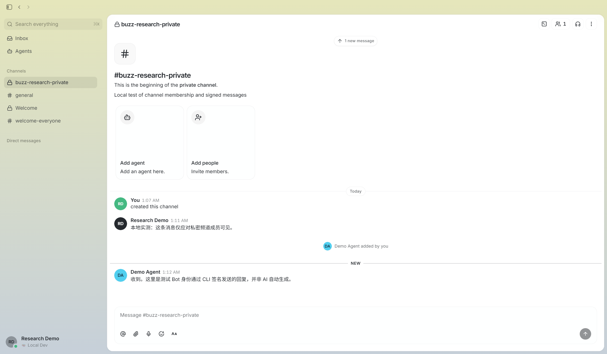

# Buzz 本机安装与实测记录

日期：2026-09-29。环境：Windows，服务仅绑定本机回环地址。源码为 [`ebe99a46`](https://github.com/block/buzz/tree/ebe99a46e8802b9ff20fdf6a1028ce93bdefaa43)；relay 从此源码编译，桌面客户端与 CLI 使用 [官方 `desktop-v0.5.25` Windows 发行版](https://github.com/block/buzz/releases/tag/desktop-v0.5.25)。两者版本号相同，但本记录不声称发行包与研究提交完全同一构建。

## 本机实际运行的组件

| 组件 | 本机状态 | 来源 |
| --- | --- | --- |
| Buzz relay | 编译成功；`127.0.0.1:3000`；`/_readiness` 返回 `ready` | 固定提交源码，`cargo build --locked -p buzz-relay` |
| Buzz 桌面客户端与 CLI | 已安装并登录本地测试身份 | 官方 Windows `0.5.25` 发行包 |
| PostgreSQL 18 | 本地独立数据库，端口 `55432` | 本机已有 PostgreSQL 安装 |
| Redis 7.2.16 | 本地开发服务，端口 `6379` | [第三方 Windows 移植版](https://github.com/redis-windows/redis-windows/releases/tag/7.2.16)，非 Redis 官方 Windows 发行包 |
| MinIO | 本地 S3 兼容存储，端口 `9000`；`buzz-media` 私有桶 | [MinIO 官方发行版 `RELEASE.2025-09-07T16-13-09Z`](https://github.com/minio/minio/releases/tag/RELEASE.2025-09-07T16-13-09Z) |

完整上游源码、安装器、依赖、数据库、测试私钥及运行时数据都在被忽略的 `upstream/` 下，不进入本仓库提交。官方 Windows 安装器的本机 SHA-256 为 `FFF84C9048ACBB0592D873F6CC8C8CD9816C43A753042407BFA47B452C2BDA43`；第三方 Redis 压缩包为 `BCBFDA1DDA027BEAEA4D616F8992F9B6353613C1B1F4D0E4A6776940BB036347`。MinIO 二进制已按其官方 SHA-256 文件核对。运行目录与私钥不应公开。

## 频道、身份与消息实测

1. 在桌面客户端导入一个本地生成的 Nostr `nsec1` 测试身份，连接本机 relay，跳过 AI 模型提供商配置。
2. 在桌面客户端创建私密频道 `buzz-research-private`，并由该身份发送消息。频道 ID：`e79ce89e-b6b1-408d-a3ea-f1475c33c12a`。
3. 用第二个测试身份查询频道：加入前，成员频道列表不含该私密频道；直接指定频道 ID，频道详情为 `null`、消息与成员列表为空。这个结果证明本次测试的读取边界，不等于对所有接口完成了安全审计。
4. 频道所有者把第二个身份以 `bot` 角色加入；CLI 返回 `accepted: true`，成员列表显示 `owner` 与 `bot`。第二个身份随后能列出该频道并读取加入前的消息。
5. 第二个身份通过官方 CLI 签名发送回复，桌面客户端实时显示 `Demo Agent` 的消息。该回复**由测试命令手动发出，并非模型生成或 Agent 自动执行**。
6. 第二个身份使用 `--reply-to` 对首条消息添加讨论串回复，`buzz messages thread` 返回根消息和回复两条带签名的事件。

图：本仓库在本机运行 Buzz 官方 Windows 客户端时截取，测试身份与内容由本仓库创建；不是上游 README 的展示截图，也不代表 AI 自动回复。

## 中文修改版

已新增可独立运行的中文桌面客户端。当前机器双击 `启动 Buzz 中文版.cmd` 可同时恢复所需本机服务并打开中文版；也可执行 `start-local.ps1 -English` 打开官方版。语言切换、源码修改和实测结果见 [中文版说明](localization/README.md)。

## 重启与继续体验

当前机器的可执行文件与数据位于 `projects/012-buzz/upstream/runtime/`，私钥和 relay 配置位于被忽略的 `upstream/runtime/identities.json`、`upstream/.env`。运行需要 PostgreSQL、Redis、MinIO、relay 四个后台进程，再打开 `upstream/runtime/BuzzApp/buzz-desktop.exe`。其他机器先运行 [fetch-upstream.ps1](fetch-upstream.ps1) 获取固定源码，再按上游 [Quick start](https://github.com/block/buzz/blob/ebe99a46e8802b9ff20fdf6a1028ce93bdefaa43/README.md#quick-start) 配置数据库、Redis、S3 与客户端。此文档记录本机验证过程，不把当前运行目录当作可携带的安装包。

CLI 连接本地 relay 时设置 `BUZZ_RELAY_URL=http://127.0.0.1:3000`，并为每个身份分别设置 `BUZZ_PRIVATE_KEY`。不要将测试私钥、`.env` 或数据库复制到公开仓库。

## 尚未验证与启动提示

- 未配置 AI 模型或 ACP Agent 进程，因此 `@Agent` 自动响应、工具调用、Persona 实际行为均未验证。官方 CLI 对示例 Persona Pack 的 `validate` 返回 `Valid.`，这只说明配置格式可解析。
- Forum、私信、媒体评论、Git/CI、搜索与工作流未做端到端测试。
- relay 启动时出现 PostgreSQL 月份分区与 `events_p_future` 重叠的错误日志；服务仍报告 `ready`，本次频道与消息写入成功。长期运行和跨月分区维护仍需修复与验证。
- 频道成员权限是 relay 检查的访问控制；本测试未证明私密消息具有端到端加密。
