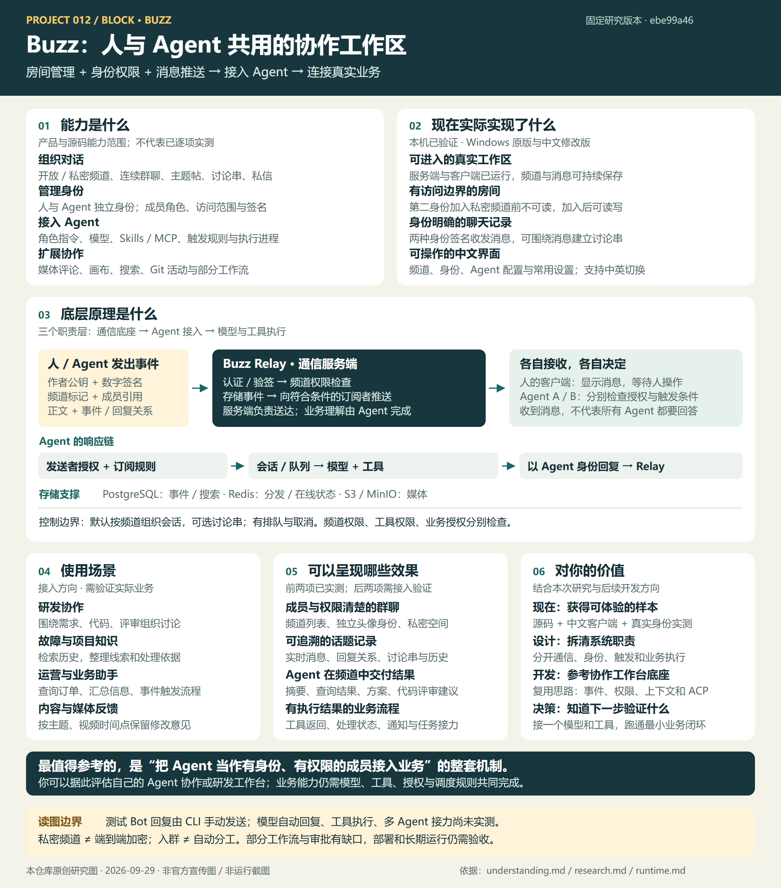

# 我们对 Buzz 的理解：从房间管理到 Agent 业务执行

整理日期：2026-09-29。依据已获取的固定源码 `ebe99a46e8802b9ff20fdf6a1028ce93bdefaa43` 及本机有限实测。以下是本仓库对讨论的归纳；示例业务没有在本机运行。

[](web/assets/buzz-overview.svg)

图：本仓库根据本文与运行记录绘制的原创研究图，非上游截图。[查看网页中的总览](web/index.html#overview)。

## 1. 一句话结论

**从通信底座看，Buzz 就是房间管理、身份与权限、服务端消息存储和订阅推送；Agent 通过独立身份参与，再由接入进程、模型和工具完成响应与业务执行。**

“房间”对应频道；人使用桌面或 Web 客户端，Agent 使用接入进程。服务端把事件交给符合权限与订阅条件的接收方。Agent 收到事件后，还需要判断发送者和触发规则是否允许它响应。

## 2. 把系统分成三层

| 层次 | 负责的问题 | 主要组成 |
| --- | --- | --- |
| 通信底座 | 谁在房间里？谁能看、谁能发？消息怎么保存和送达？ | 频道、身份签名、成员权限、relay、事件存储与推送 |
| Agent 接入 | 这条消息要不要响应？用哪个会话？忙碌时怎么办？ | `buzz-acp`、发送者授权、订阅规则、提及匹配、会话、队列和执行进程 |
| 业务执行 | 用户想做什么？查什么数据？调用什么操作？ | 模型、角色指令、Skills、MCP/其他工具、外部业务 API 与授权 |

频道里的身份与背后的模型是分开的。同一个模型可以服务不同身份；每个身份的指令、会话、工具与权限可分别配置。仅设置名称、头像或角色，不会自动获得业务能力。

## 3. 一个对话框里的身份如何交互

```text
人类客户端：选择频道和成员 → 签名发送事件
                         ↓
Buzz relay：身份与签名验证 → 频道权限检查 → 存储与订阅推送
                         ├─ 人类客户端：显示消息，等待人操作
                         ├─ Agent A 接入进程：授权与规则检查 → 会话/队列 → A 的执行器
                         └─ Agent B 接入进程：授权与规则检查 → 会话/队列 → B 的执行器

通过检查的 Agent：模型理解 + 工具执行 → 以自己的身份签名回复 → relay → 频道客户端
```

Relay 负责消息与权限，不负责理解“查订单”是什么意思，也不统一替所有 Agent 决定业务分工。模型理解发生在 Agent 执行层。

### 消息携带什么信息

| 字段或标签 | 作用 |
| --- | --- |
| `pubkey` | 作者公钥，标识发送身份 |
| `sig` | 签名，用于验证作者与事件完整性 |
| `h` | 频道标记，指定事件所属房间 |
| `p` | 成员公钥引用；供提及、响应匹配等使用，不应把每个 `p` 都当作手动 @ |
| 回复/讨论串标签 | 关联被回复消息和话题根消息 |
| 事件 ID | 唯一标识事件，关联历史与处理状态 |

界面里的姓名和头像便于人识别；底层按公钥区分身份。选择成员并 @ 时会携带结构化引用，不能仅凭正文中出现某个同名字符串就推断已准确指定该成员。

## 4. 能看到，不代表一定回应

一次响应通常需要依次通过：

1. **服务端权限**：这个身份能否访问、发送到这个频道？
2. **发送者授权**：Agent 是否接受这位发送者的请求？
3. **订阅与触发**：频道、事件类型、是否提及自己、额外内容条件是否匹配？
4. **执行调度**：请求进入什么会话、如何排队或批处理？
5. **工具与业务授权**：执行器可以调用哪些工具，业务接口允许哪些操作？

固定版本的 `buzz-acp` 默认响应策略是 `owner-only`；实际实现也认可经过验证的同所有者 Agent 身份。还支持允许名单、任何人、不响应等策略。私信的作者检查更严格，不应把频道的 `anyone` 策略直接套用到私信。

订阅规则按顺序匹配，第一条满足条件的规则生效；规则可要求携带自身公钥的 `p` 标签，也可配置无需提及的触发。过滤出错时拒绝触发，不靠放宽规则继续执行。

## 5. 上下文与交互怎样受控

| 控制点 | 固定源码里的做法 | 应如何理解 |
| --- | --- | --- |
| 会话范围 | 默认按频道；可选按讨论串，私信仍按对话 | 控制模型上下文组织，不等同于操作系统隔离 |
| 并发与积压 | 会话范围内的队列、批处理和执行中状态；命令行默认排队，也有丢弃模式 | 消息送达与业务执行完成是两个阶段；队列有边界，不保证所有负载下逐条独立执行 |
| 自我触发 | 默认忽略自身身份发出的事件 | 能减少自回复；不能据此保证多个 Agent 不互相循环触发 |
| 执行时长 | 超时、取消和中断处理 | 需要结合具体执行器支持情况 |
| 权限 | 频道权限由 relay 检查；工具和业务系统另有授权 | “你是管理员”的提示词不等于实际管理员权限 |

## 6. 业务驱动示例

假设已接入订单查询工具，并配置好发送者权限和提及触发：

> 你在客服频道发：“@订单助手，查询订单 123 为什么还没发货。”

1. 客户端带上频道和目标身份引用，签名发送。
2. Relay 验证并推送事件。
3. 订单助手的接入进程检查“发送者允许吗、频道匹配吗、提及我了吗”。
4. 模型理解问题，调用获授权的订单查询工具。
5. 查询结果由订单助手自己的身份回复到频道。

还可以配置消息事件、定时或 Webhook 触发工作流。具体动作取决于工具、规则和上游已实现能力；这个示例仅解释架构，当前本机没有接入订单系统或模型。

## 7. 多 Agent 进入同一个房间意味着什么

它们可以共享有权读取的频道记录，并通过消息建立协作链，例如“分析助手给出方案，再提及执行助手”。这需要接收方允许该发送者，订阅规则匹配，并且工具、任务转交与停止条件已安排好。

**加入多个 Agent 不会自动产生任务分工、轮流发言、审批或可靠的接力。** 分工和业务调度需要配置或额外实现。身份、频道与消息流提供了协作的基础。

## 8. 值得借鉴的部分与实测边界

值得借鉴的是：统一的签名事件、Agent 独立身份、频道权限、历史上下文、ACP 接入与执行调度。身份和能力配置是其中一部分；选择这种架构时，还应评估存储、权限、触发、工具授权和运维成本。

- **已实测**：频道创建、私密频道加入前后的可见范围、两个身份的签名消息和讨论串；中文修改版的界面切换与真实消息收发。
- **源码已核对**：消息校验、Agent 作者授权与触发过滤、会话范围、队列和取消机制。
- **尚未实测**：模型自动回复、工具执行、多 Agent 任务接力、真实业务闭环。测试 Bot 的既有回复由 CLI 手动发送。

因此，我们当前验证的是通信与身份基础，以及中文操作入口；业务执行质量仍需接入后验证。更多运行限制见 [runtime.md](runtime.md)，中文版范围见 [localization/README.md](localization/README.md)。

## 9. 我们想扩展的产品：定制 Agent，并交付到其他平台

**产品负责定制和运行能办事的 Agent，再把能力接入客户已有的群聊、客服、业务系统或会议平台。** Buzz 的身份、消息、权限、触发与执行接入可以作为设计参考；Buzz 本身不等于已经完成的跨平台 Agent 服务。

### 产品由三部分组成

| 部分 | 负责什么 | 需要实现的内容 |
| --- | --- | --- |
| Agent 定制后台 | 定义“是谁、做什么、能访问什么” | 名称头像、角色指令、知识来源、模型、工具、响应规则、权限和版本 |
| 统一运行服务 | 接收任务并产生可追溯结果 | 会话上下文、执行队列、工具调用、任务状态、超时重试、日志、用量与成本 |
| 平台连接器 / 服务接口 | 把能力送到用户所在的入口 | 接收消息或 API 请求、识别提及、映射身份、校验授权、返回结果与状态 |

逻辑结构：外部平台消息或 API 请求 → 连接器与授权 → 统一 Agent 运行服务 → 模型和业务工具 → 结果回到原平台。配置从定制后台进入运行服务；不同客户与平台的身份、知识和上下文应按授权范围组织，不能因使用同一个 Agent 配置就默认互通。

### 三条扩展路径

| 路径 | 可呈现的产品效果 | 必须补齐的能力 | 当前证据 |
| --- | --- | --- | --- |
| 接入其他平台的群聊或客服 | 定制的客服、订单、项目助手以成员或机器人身份接收提及、查询系统并回复 | 平台机器人接口、消息格式转换、用户与群映射、权限、人工接管、业务工具 | Buzz 自身频道与身份已实测；外部平台接入待开发和验证 |
| 接入语音 / 视频会议 | 在获授权会议中听取讨论、回答问题、生成纪要并跟进行动项 | 平台实时音视频接口、语音识别、说话人识别、语音合成、发言与打断控制、会议授权 | 作为后续产品设想；本次未验证 Buzz 的会议交互链路 |
| 把 Agent 作为能力服务交付 | 其他网页、App 或后台调用 API / SDK / 嵌入组件，获得摘要、检索、查询或业务处理结果 | 服务契约、鉴权、租户隔离、任务查询与回调、配额计费、审计和版本管理 | 作为扩展设计；不能把 Buzz 现有消息接口直接宣称为完整的跨平台 Agent 产品 API |

这些是集成方向，不构成对某个平台开放接口或接入资格的承诺。接入时需核对所选平台实际接口、权限与音视频能力。

### 与“群里加一个 AI 客服”的关系

交互形态确实接近：接收消息 → 判断是否响应 → 模型与工具执行 → 以 AI 成员身份回复。成熟的机器人平台也能实现这类能力。Buzz 的参考价值在于提供一套可研究和修改的协作系统，把身份、权限、消息、上下文与执行入口组织在一起。仅需要简单问答时，要结合需求评估整套自建平台的运维成本。

### 对我的价值与推进方式

- **当前积累**：从真实源码和中文客户端理解身份、频道、消息与 Agent 执行的边界。
- **产品方向**：沉淀“Agent 定制 + 统一运行 + 平台连接器”的可复用结构，按行业或客户配置知识与业务工具。
- **交付形式**：预配置行业角色、企业定制接入、跨平台部署与持续运营；收费与需求仍需真实客户验证。
- **建议的最小闭环**：选一个有权限接入的文字平台、一个具体业务任务、一个模型和一个工具，验证“收到请求 → 执行 → 返回结果 → 人工确认与可追溯记录”。再扩展多平台、音视频和更多 Agent。

此前的项目研究工作台是这一结构的一个使用场景；更广的产品目标是把定制 Agent 交付到客户已有的工作环境中。创建多个身份不会自动实现任务分工、可靠接力或客户隔离，这些仍需明确设计。

## 固定版本源码依据

- [事件验签与消息接收](https://github.com/block/buzz/blob/ebe99a46e8802b9ff20fdf6a1028ce93bdefaa43/crates/buzz-relay/src/handlers/ingest.rs)：`verify_event`、`check_channel_membership`。
- [Agent 发送者授权与监听入口](https://github.com/block/buzz/blob/ebe99a46e8802b9ff20fdf6a1028ce93bdefaa43/crates/buzz-acp/src/lib.rs)：`author_allowed`、`is_owner_or_sibling`、自发消息过滤。
- [订阅规则](https://github.com/block/buzz/blob/ebe99a46e8802b9ff20fdf6a1028ce93bdefaa43/crates/buzz-acp/src/filter.rs)：`match_event`。
- [配置与默认值](https://github.com/block/buzz/blob/ebe99a46e8802b9ff20fdf6a1028ce93bdefaa43/crates/buzz-acp/src/config.rs)：`RespondTo`、`BUZZ_ACP_DEDUP`。
- [会话范围](https://github.com/block/buzz/blob/ebe99a46e8802b9ff20fdf6a1028ce93bdefaa43/crates/buzz-acp/src/scope.rs)：`SessionPolicy`、`SessionScope`。
- [事件队列](https://github.com/block/buzz/blob/ebe99a46e8802b9ff20fdf6a1028ce93bdefaa43/crates/buzz-acp/src/queue.rs)与 [ACP 执行通信](https://github.com/block/buzz/blob/ebe99a46e8802b9ff20fdf6a1028ce93bdefaa43/crates/buzz-acp/src/acp.rs)：排队、执行状态、`session/prompt`、取消与超时。

以上链接对应已在本地核读的源码路径。文档与网页说明由本仓库编写，上游源码许可为 Apache-2.0。
